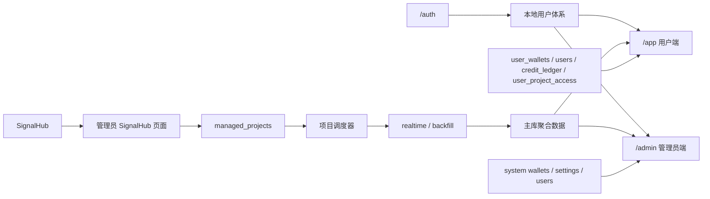

# Virtuals Whale Radar

Virtuals Whale Radar 是一个用来盯项目、盯资金、盯钱包的观察台。

它不是交易软件，也不是自动下单工具。  
它更适合在项目发射前后，帮你快速回答这几个问题：

- 现在有哪些项目值得提前看
- 某个项目发射时，大户有没有在买
- 自己关注的钱包有没有进场
- 某个项目值不值得继续花时间盯

---

## 第一部分：面向用户的使用教程

这一部分只讲怎么用，不讲技术。

### 1. 你进入后会看到什么

普通用户主要会用到 5 个页面：

#### 1. `实时看板`

这是最核心的页面。

你可以看到：

- 当前项目名称
- 开始时间和结束时间
- 项目详情链接
- 代币地址和内盘地址
- 分钟消耗图
- 大户榜单
- 追踪钱包持仓
- 交易录入延迟

如果你已经解锁了某个项目，这一页就是你最常用的页面。

#### 2. `项目列表`

这里会看到系统里已经关注或已经结束的项目。

你可以先看基础信息：

- 项目名称
- 开始时间
- 结束时间
- 当前状态
- 项目详情

项目列表适合用来决定：
- 哪个项目值得解锁
- 哪个项目值得回看
- 哪个项目只是简单浏览一下就够了

#### 3. `即将发射`

这里会展示近期 upcoming 项目。

你可以用它来：

- 提前看未来 24 小时、72 小时或 7 天内的项目
- 快速浏览项目名、时间、详情
- 看看有没有你不想漏掉的新项目

#### 4. `我的钱包`

这里是你自己的钱包管理页。

你可以：

- 添加钱包
- 给钱包起名字
- 修改钱包名称
- 删除钱包

这里的钱包数据只属于你自己。  
别的用户看不到你的钱包。

#### 5. `积分充值`

这里会看到：

- 当前剩余积分
- 累计消耗积分
- 已解锁项目数
- 当前充值档位
- 微信联系方式二维码

现在不接在线支付。  
如果你想充值，直接在这里扫码联系，管理员确认后会手动给你补积分。

### 2. 你第一次使用时，建议这样走

如果你是第一次用，建议按这个顺序来：

#### 第一步：注册账号

注册时需要填写：

- 昵称
- 邮箱
- 密码

提交后，系统会发一封验证邮件到你的邮箱。  
只有完成邮箱验证后，账号才会正式创建。

#### 第二步：完成邮箱验证

你去邮箱里打开验证邮件，点击里面的链接。  
验证成功后，系统会自动登录，并把新手积分发到你的账号里。

当前默认规则：

- 新用户完成邮箱验证后，赠送 `20` 积分

#### 第三步：先去“我的钱包”添加钱包

建议你先把自己的钱包加进去。

这样后面看项目时，你就能直接看到：

- 自己的钱包有没有参与
- 自己关注的钱包有没有进场

#### 第四步：去“即将发射”或“项目列表”看项目

先不要急着解锁。

建议你先：

- 浏览 upcoming 项目
- 看看项目时间和详情
- 确定你真正想盯的是哪几个

#### 第五步：只解锁你真正关心的项目

当你决定要认真看某个项目时，再去解锁它的详细看板。

当前规则：

- 每解锁一个项目，消耗 `10` 积分
- 同一个项目只扣一次
- 解锁后，之后可以一直看这个项目

### 3. 积分是怎么用的

规则很简单：

- 新用户完成邮箱验证后，送 `20` 积分
- 每个项目首次解锁，消耗 `10` 积分
- 同一个项目不会重复扣分

当前充值档位：

- `10` 积分 = `10` 元
- `50` 积分 = `40` 元

你可以先免费注册、先加钱包、先看列表。  
等你决定认真盯一个项目时，再花积分解锁详细数据。

### 4. 一个用户最常见的使用方式

最常见的一条路径就是：

`注册 -> 验证邮箱 -> 添加钱包 -> 浏览即将发射 -> 选择项目 -> 解锁实时看板 -> 持续观察`

你不需要一上来就把所有项目都看完。  
更合理的方式是：

- 先广泛浏览
- 再少量解锁
- 最后长期跟踪真正值得盯的项目

### 5. 管理员和普通用户有什么区别

普通用户能做的是：

- 看实时看板
- 看项目列表
- 看即将发射
- 管理自己的钱包
- 使用积分充值页

普通用户不能做的是：

- 新建项目
- 编辑项目
- 删除项目
- 勾选关注项目
- 修改全局设置
- 管理别人的钱包

管理员除了看数据，还能做：

- 管理项目
- 管理 `SignalHub` 关注列表
- 管理全局钱包
- 管理用户
- 手动加积分、扣积分
- 查看所有用户的钱包和积分情况

### 6. 常见问题

#### 为什么我能看到项目列表，却看不了详细大盘？

因为项目列表和 upcoming 列表默认免费可看。  
但详细的项目看板需要按项目解锁。

#### 为什么我加的钱包别人看不到？

因为普通用户的钱包默认是私有的。  
系统会按用户隔离。

#### 为什么充值不是在线支付？

当前版本先走最简单、最稳定的方式：  
你扫码联系，管理员确认后手动补积分。

#### 我解锁过的项目以后还要再扣分吗？

不用。  
同一个项目只在第一次解锁时扣分。

#### 我第二天还能回看已经结束的项目吗？

可以。  
已经结束的项目会保留在项目列表里，你仍然可以回看历史详情。

### 7. 一句话理解这个产品

Virtuals Whale Radar 不是让你“直接操作”的。  
它更像一个专门帮你盯项目、盯资金、盯钱包的观察台。

如果你是第一次用，最简单的理解就是：

`先看项目 -> 再选重点 -> 再解锁 -> 再持续观察`

---

## 第二部分：面向开发者的系统结构说明

这一部分面向开发、维护和部署人员。

### 1. 这个系统由什么组成

当前系统不是单一页面，而是一个完整的双角色产品：

- 用户端：`/app/*`
- 管理员端：`/admin/*`
- 认证入口：`/auth/*`
- 项目上游来源：`SignalHub`
- 主运行时：`writer / realtime / backfill`

系统目标是：

- 从 `SignalHub` 获取 upcoming 项目
- 管理员决定哪些项目进入关注列表
- 后端按项目时间窗口自动调度
- 实时采集 + 持续回扫
- 将分钟图、大户榜、钱包持仓、延迟等聚合给前端展示

### 2. 系统结构总览



### 3. 前端结构

前端工程在：

- `frontend/admin`

当前是一套统一 SPA，按角色分路由：

- `auth`
  - 登录
  - 注册
  - 邮箱验证
- `app`
  - 实时看板
  - 项目列表
  - 即将发射
  - 我的钱包
  - 积分充值
- `admin`
  - 实时看板
  - 项目管理
  - SignalHub
  - 钱包管理
  - 用户管理
  - 设置

前端核心特点：

- React + Vite + TypeScript
- 同一套组件同时服务用户端和管理员端
- 已支持浅色 / 深色主题
- 用户端和管理员端共用部分项目详情组件，但权限边界不同

### 4. 后端结构

当前后端主入口是：

- `virtuals_bot.py`

虽然它目前仍是单文件主程序，但内部已经承担了多类职责：

- 配置加载
- SQLite 存储
- 认证与会话
- 用户与积分
- 项目管理
- 调度器
- 实时采集
- 回扫
- 聚合接口
- 管理员接口
- 用户接口

项目上游客户端在：

- `signalhub_client.py`

它负责从 `SignalHub` 拉取 upcoming 项目，并映射到当前系统的项目模型。

### 5. 运行角色

当前运行依赖 3 个主角色：

- `writer`
  - 负责 API、页面、写入和聚合查询
- `realtime`
  - 负责实时监听链上数据
- `backfill`
  - 负责历史补扫、项目级持续回扫、final sweep

此外还有独立的：

- `SignalHub`
  - 负责项目发现、上游 upcoming 数据获取和地址识别

### 6. 自动调度逻辑

项目被管理员加入关注后，会进入 `managed_projects`。

项目状态机会经历：

- `draft`
- `scheduled`
- `prelaunch`
- `live`
- `ended`

调度规则：

- 开始前 `30` 分钟进入 `prelaunch`
- 自动启用实时采集
- 自动触发项目级回扫
- 活跃期间持续滚动补扫
- 结束后自动执行 final sweep

所以当前系统不是靠人工不停点“回扫”，而是：

- 实时采集持续跑
- 项目级回扫持续自动补
- 结束后再做一次收尾补扫

### 7. 数据库与数据职责

当前核心有 3 个 SQLite 数据库：

#### 1. 主库

- `data/virtuals_v11.db`

主要保存：

- 用户数据
  - `users`
  - `pending_registrations`
  - `user_wallets`
  - `credit_ledger`
  - `user_project_access`
  - `user_notifications`
- 项目数据
  - `managed_projects`
  - `events`
  - `minute_agg`
  - `leaderboard`
  - `wallet_positions`

#### 2. 总线库

- `data/virtuals_bus.db`

主要保存：

- `scan_jobs`
- `event_queue`
- 运行期任务队列与状态

#### 3. SignalHub 库

- `SignalHub-main/signalhub.db`

主要保存：

- 上游项目抓取结果
- 项目地址识别状态
- SignalHub 自身运行数据

### 8. 关键数据流

完整链路大致如下：

1. `SignalHub` 抓 upcoming 项目
2. 管理员在 `SignalHub` 页面加入关注
3. 项目写入 `managed_projects`
4. 调度器按开始时间推进项目状态
5. `realtime` 持续监听
6. `backfill` 持续补扫
7. 交易进入 `events`
8. 聚合写入：
   - `minute_agg`
   - `leaderboard`
   - `wallet_positions`
9. 用户端和管理员端读取聚合数据展示

### 9. 认证与用户体系

当前认证仍然是本地用户体系，不依赖 Supabase。

注册流程：

1. 用户提交昵称、邮箱、密码
2. 系统先写入 `pending_registrations`
3. 发送验证邮件
4. 用户点击验证链接
5. 验证成功后正式创建 `users`
6. 发放 `20` 积分
7. 自动创建 session 并登录

当前生产环境已启用：

- HTTPS
- 邮箱验证注册
- `Secure + HttpOnly + SameSite=Lax` session cookie
- 第一版认证防刷限流

### 10. 角色与权限边界

普通用户：

- 只能看 `Overview / Projects / SignalHub`
- 只能管理自己的 `Wallets`
- 可以在 `Billing` 查看积分和充值方式
- 查看项目详细看板时受积分解锁限制

管理员：

- 拥有项目管理能力
- 管理关注项目
- 管理全局钱包
- 管理用户、积分、状态
- 可以看已结束项目的完整历史仪表盘

### 11. 目录结构建议理解方式

你可以把仓库按这个方式理解：

```text
frontend/admin/                前端 SPA
docs/                          计划、清单、说明文档
deploy/                        部署、systemd、logrotate、安装脚本
scripts/ops/                   备份、诊断等运维脚本
SignalHub-main/                上游项目发现服务
data/                          本地数据库与运行数据
virtuals_bot.py                主后端程序
signalhub_client.py            SignalHub 适配层
config.example.json            配置模板
config.json                    实际运行配置
```

### 12. 配置文件约定

开发和运维要注意区分：

- `config.example.json`
  - 说明模板
  - 用来展示字段结构
- `config.json`
  - 实际运行配置
  - 本地和生产都依赖它

当前协作规则已经固定：

- 只要 `config.example.json` 新增字段
- 同步就要补进 `config.json`

### 13. 生产部署现状

当前生产站点：

- [https://virtuals.club](https://virtuals.club)

已经具备：

- HTTPS
- 邮箱验证注册
- `SignalHub`
- `writer / realtime / backfill`
- 自动调度
- 已结束项目历史回看

### 14. 运维能力

当前已经补齐最小运维三件套：

#### 备份

- 脚本：`scripts/ops/backup_runtime.sh`
- 定时：每天 `04:15`
- 输出目录：`/opt/virtuals-whale-radar/backups`

备份内容包含：

- 主库
- 总线库
- SignalHub 库
- `events.jsonl`
- 用户上传的付款凭证目录
- 运行配置
- 证书文件
- nginx / systemd / logrotate 配置

#### 日志轮转

- 配置：`deploy/logrotate/virtuals-whale-radar`

#### 一键诊断

- 脚本：`scripts/ops/diagnose_runtime.sh`
- 输出目录：`/opt/virtuals-whale-radar/diagnostics`

### 15. 文档入口

如果你要继续维护这个项目，优先看：

- `docs/PLAN.md`
  - 最新产品和技术方案总文档
- `docs/todo.md`
  - 当前执行清单

### 16. 这个系统当前最适合的理解方式

不要把它理解成“一个普通网站”。

更准确的理解是：

- 一个用户端产品
- 一个管理员运营台
- 一个链上采集与补扫系统
- 一个项目发现上游 `SignalHub`
- 一套积分、解锁、邮箱验证和用户管理系统

它是一个完整产品，而不是单页 Demo。

---

## 当前状态

当前版本已经具备：

- 用户注册、邮箱验证、登录
- 项目发现与关注
- 自动调度
- 实时采集与持续回扫
- 用户钱包私有化
- 积分解锁
- 手动充值入账
- 管理员用户管理
- 历史项目回看
- HTTPS
- 备份、日志轮转、一键诊断

如果你是普通用户，直接从注册开始。  
如果你是开发者，优先先读 `docs/PLAN.md`，再看本 README 的第二部分。
