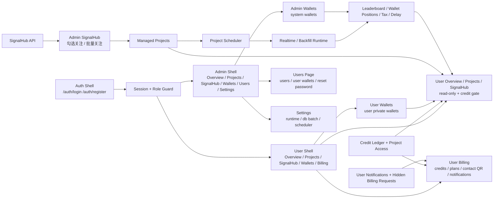
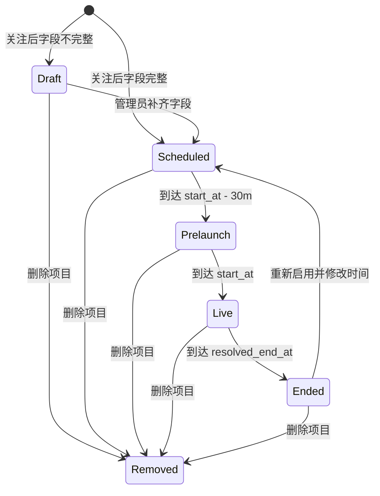
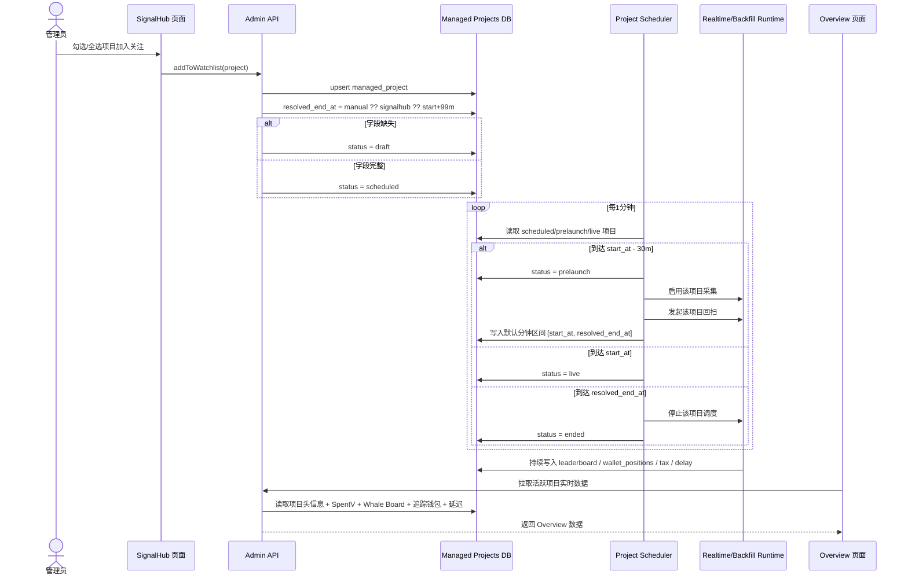
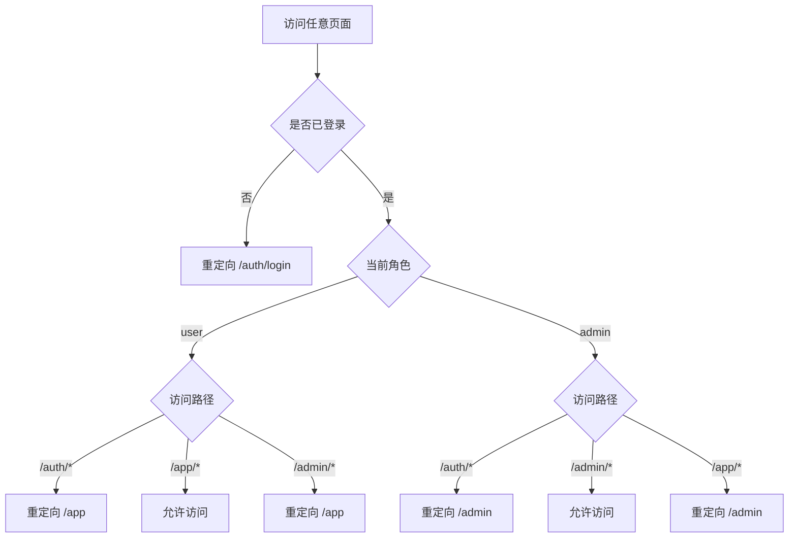
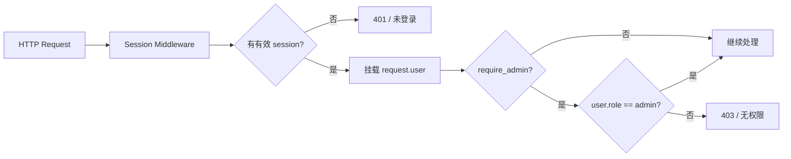
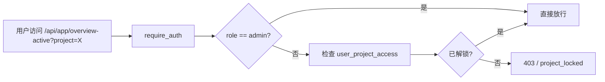

# Virtuals Whale Radar 管理后台迭代版重构方案

## 1. 目标

本轮目标从“单一管理员后台重构”升级为“管理员端 + 用户端”的双角色系统。

核心目标：

- 将 `Overview` 改为“当前发射项目实时看板”，只读，不承担编辑职责。
- 将 `Projects` 改为“项目管理页”，承接项目新增、删除、编辑、采集、回扫和调度状态。
- 将 `SignalHub` 改为“关注列表入口”，支持勾选/全选项目并同步进入 `Projects`。
- 将 `Wallets` 单独作为一级页面，集中管理追踪钱包的地址和名称。
- 将 `Settings` 收敛为全局设置页，只保留系统级配置，不放项目级编辑。
- 将后端从“手动操作驱动”升级为“基于项目时间窗口自动调度”。
- 新增用户注册、登录、会话与角色权限体系。
- 新增用户端 `/app`，提供 `Overview / Projects / SignalHub / Wallets / Billing` 五页。
- 新增管理员 `Users` 页面，用于查看、禁用、重置用户并查看所有用户钱包。
- 将钱包数据拆成“管理员全局钱包”和“用户私有钱包”两套模型。
- 新增“积分解锁 + Billing + 管理员手动加减积分”的轻量商业闭环。
- 保留用户通知中心，但当前充值处理走“微信付款 + 管理员在 Users 内手动入账”的轻流程。
- 保留 `Projects` 里的 `ended` 项目，并允许用户回看历史项目详情。

## 2. 已确认决策

- 品牌名称统一为 `Virtuals Whale Radar`。
- 左侧栏保留，但支持桌面端直接隐藏；不是只在移动端折叠。
- 左侧栏一级导航固定为：
  - `Overview`
  - `Projects`
  - `SignalHub`
  - `Wallets`
  - `Settings`
- `Overview` 默认展示“当前活跃项目”；如果有多个活跃项目，顶部提供切换器。
- `Overview` 只读，不允许编辑项目。
- `Projects` 页面顶部提供 `新建项目` 与 `删除项目`，删除支持批量。
- `Wallets` 独立成页，钱包字段只有：
  - `钱包地址`
  - `名称`
- `Settings` 只保留全局设置，不包含用户配置。
- 结束时间优先级固定为：
  - `管理员手动设置`
  - `SignalHub 结束时间`
  - `开始时间 + 99 分钟`
- `+99` 的单位固定为 `99 分钟`。
- 分钟消耗 `SpentV` 柱状图放在 `Overview` 项目头下面，作为实时主图。
- 删除项目的语义固定为：
  - `取消关注`
  - `从 Projects 移除`
  - `停止调度`
  - `保留历史数据`
- 未登录访问业务页时，统一跳转到 `/auth/login`。
- 注册字段固定为：`昵称 / 邮箱 / 密码`。
- 注册成功后默认直接登录，并进入角色对应首页。
- 用户端一级导航固定为：
  - `Overview`
  - `Projects`
  - `SignalHub`
  - `Wallets`
  - `Billing`
- 管理员端一级导航升级为：
  - `Overview`
  - `Projects`
  - `SignalHub`
  - `Wallets`
  - `Users`
  - `Settings`
- 用户端 `Wallets` 可编辑，但数据只属于当前登录用户，互不可见。
- 用户端 `Overview / Projects / SignalHub` 全部只读，不提供任何编辑、删除、勾选、采集、回扫入口。
- 用户查看某个项目的 `Overview` 详细数据时，按“每用户、每项目首次解锁”扣 `10` 积分。
- 同一用户对同一项目解锁后永久可看，不重复扣分。
- 新用户注册赠送 `20` 积分。
- 充值方案固定为：
  - `10 积分 = 10 元`
- `50 积分 = 40 元`
- 用户端 `Projects` 与 `SignalHub` 列表免费可看，但未解锁项目的 `Overview` 详细数据不可看。
- 用户积分不足时，点击未解锁项目应引导到 `Billing`。
- `Billing` 页面展示联系方式二维码，不接入在线支付。
- 用户通知支持 `未读 / 已读 / 全部已读`，并在顶栏显示未读提醒。
- 当前不单独设置充值申请流程；用户微信付款后，管理员直接在 `Users` 页面手动补积分。
- `billing_requests` / 付款凭证附件能力保留为备用后端能力，但不是当前产品主流程。
- 链上 RPC 使用策略升级为：`实时采集 / 历史回扫 / SignalHub 识别` 分池使用；回扫池按 `专用 Chainstack -> 备用 Chainstack -> 主实时 Chainstack -> 公共 Base RPC` 顺序自动降级。
- `Billing` 顶部固定展示邀请文案与注册链接：
  - 文案：`Virtuals 新用户使用邀请码注册，后续付费一律五折`
  - 链接：`https://app.virtuals.io/referral?code=LFfW5x`
- 管理员调整积分时只允许“加积分 / 扣积分 + 备注”，不直接裸改余额。
- 管理员可以查看所有用户的钱包，但用户之间互不可见。
- 管理员默认不直接查看完整密码哈希，只提供密码状态和重置能力。
- 初始管理员账号通过启动配置或环境变量 bootstrap 创建。

## 3. 最终信息架构



## 4. 壳层与导航

### 4.1 壳层职责

- `Sidebar` 只负责导航，不再承载冗余统计信息。
- `Top Bar` 只负责：
  - 侧栏切换
  - 品牌展示
  - 当前活跃项目切换
  - 全局 runtime 状态
  - 刷新
- 页面主体只展示当前路由所需信息，不重复在不同区域表达同一状态。

### 4.2 左侧栏三态

- `Expanded`：图标 + 文本
- `Rail`：仅图标
- `Hidden`：完全隐藏

状态需要持久化到 `localStorage`。

### 4.3 默认落点

- 当存在 `live / prelaunch` 项目时，默认落到 `Overview`
- 当不存在活跃项目时，默认落到 `Projects`

## 5. 页面定义

## 5.1 Overview

`Overview` 是“正在发射项目的实时看板”，只读，不承担项目管理和编辑。

### 布局结构

```text
项目切换器
项目头信息
实时主图：分钟消耗 SpentV（柱状图）
Whale Board
追踪钱包持仓
交易录入延迟（默认折叠）
```

### 模块说明

#### A. 项目头信息

必须展示：

- 项目名称
- 开始时间
- 结束时间
- 项目详情链接
- 代币地址
- 内盘地址
- 当前项目累计税收

不展示：

- 编辑按钮
- 项目配置表单
- 全局设置

#### B. 实时主图

- 图表类型：`分钟消耗 SpentV 柱状图`
- 默认区间：`[项目开始时间, 项目结束时间]`
- 图表的时间窗口由调度器自动同步
- 图表位于项目头下面，作为页面主视觉
- `minute_agg.minute_key` 的定义固定为：`该分钟起点的 Unix 秒级时间戳`
- 例如 `19:30:17` 的交易会归入 `19:30:00` 对应的 `minute_key`
- 前后端都必须把它当作“已对齐到分钟的秒级时间戳”使用，不能再额外乘以或除以 `60`

#### C. Whale Board

字段固定为：

- 钱包地址
- 累计花费 V
- 累计代币数量（万）
- 买入市值（万 USD）
- 更新时间

#### D. 追踪钱包持仓

字段保持和 `Whale Board` 一致：

- 钱包地址
- 累计花费 V
- 累计代币数量（万）
- 成本（万）
- 更新时间

这块数据来源是全局钱包名录中的追踪钱包，不再单独定义另一套展示模型。

#### 展示口径补充

- `累计 SpentV` 与 `峰值分钟` 统一按整数展示，不保留小数位。
- 分钟消耗柱状图顶部数值标签统一按整数展示，不保留小数位。
- `买入市值` 字段沿用 `FDV_USD` 推算逻辑，但前端展示单位统一换算为 `万 USD`。

#### E. 交易录入延迟

- 默认折叠
- 展开后展示延迟表
- 用于排查写入和解析问题，不参与首屏信息竞争

### 交互规则

- 顶部允许切换“当前活跃项目”
- 页面不提供项目编辑入口
- 页面不提供项目删除入口
- 管理员 `Overview` 只做数据展示和刷新
- 用户 `Overview` 只有在项目已解锁后才可看到完整数据
- 未解锁时展示锁定态，并提示：
  - 解锁将消耗 `10` 积分
  - 当前剩余积分
  - `解锁项目`
  - `去 Billing`

## 5.2 Projects

`Projects` 是“项目管理页”，承接项目的新增、删除、编辑、运行控制和调度可视化。

### 页面顶部

必须包含两个主按钮：

- `新建项目`
- `删除项目`

其中：

- `删除项目` 支持批量
- 删除语义为：
  - 取消关注
  - 从本地项目列表移除
  - 停止调度
  - 保留历史数据

### 列表结构

项目列表一行一个项目，每行展示：

- 项目名称
- 开始时间
- 结束时间
- 项目详情
- 当前状态
- 选择框
- 折叠按钮

### 展开后结构

展开后展示：

- 代币地址
- 内盘地址
- 运行状态
- `采集` 按钮
- `回扫` 按钮
- `编辑` 按钮

### 行为定义

#### 采集

定义为：`启用/停用该项目监控资格`

不是启动一个独立进程，而是控制该项目是否参与全局运行时。

#### 回扫

定义为：`立即按该项目时间窗口发起一次回扫任务`

#### 编辑

编辑入口在本页完成，允许修改：

- 项目名称
- 开始时间
- 结束时间
- 项目详情
- 代币地址
- 内盘地址
- 监控相关状态

### 数据来源

`Projects` 页面展示两类项目：

- 来自 `SignalHub` 并被加入关注列表的项目
- 管理员手动创建的项目

### 用户侧只读规则

- 用户端 `Projects` 不展示：
  - 新建
  - 删除
  - 编辑
  - 采集
  - 回扫
- 用户端列表额外展示：
  - 是否已解锁
  - 解锁成本（固定 `10`）
- 用户点击未解锁项目进入 `Overview` 时：
  - 若积分足够，弹确认框后解锁
  - 若积分不足，引导去 `Billing`
- 对于 `ended` 项目，用户端从 `Projects` 进入的是“历史项目详情”页面，而不是活跃项目 `Overview`
- 历史项目详情需要展示：
  - 分钟消耗 `SpentV`
  - Whale Board
  - 追踪钱包持仓
  - 交易录入延迟

## 5.3 SignalHub

`SignalHub` 是“关注列表入口”，不再以“导入项目”作为核心心智。

### 页面目标

- 展示 upcoming 项目
- 支持勾选/全选
- 支持加入关注和取消关注
- 关注后自动同步到 `Projects`
- 用户侧只读浏览 upcoming 列表

### 列表字段

每行至少展示：

- 项目名称
- 开始时间
- 结束时间（解析后的最终时间）
- 项目详情
- 字段完整度
- 当前状态

### 核心操作

- 单选加入关注
- 单选取消关注
- 全选
- 批量加入关注
- 批量取消关注

### 用户侧只读规则

- 用户端不显示：
  - 勾选框
  - 加入关注
  - 取消关注
  - 批量操作
- 用户端可看到：
  - 项目基础信息
  - 若该项目已进入受管项目列表，则看到对应的解锁状态

### 同步规则

当管理员勾选关注后：

- 项目立即写入本地 `Managed Projects`
- 项目立即出现在 `Projects`
- 若关键字段不足，进入 `draft`
- 若字段完整，进入 `scheduled`

### 结束时间解析

解析顺序固定为：

`manual_end_at ?? signalhub_end_at ?? start_at + 99 分钟`

在 `SignalHub` 列表中展示的是“解析后的最终结束时间”。

## 5.4 Wallets

`Wallets` 在双角色体系下拆为两种：

- 管理员端 `Wallets`：全局追踪钱包管理
- 用户端 `Wallets`：当前登录用户自己的钱包管理

### 页面职责

- 新增钱包
- 编辑钱包
- 删除钱包

### 钱包字段

- 钱包地址
- 名称

### 与其它页面关系

- `Overview` 中“追踪钱包持仓”使用这里维护的钱包列表
- `Wallets` 不做项目级绑定，默认是全局钱包名录

## 5.5 Billing

`Billing` 是用户端一级页面，用于展示积分状态、充值方案、联系方式二维码和邀请信息。

### 页面目标

- 展示当前用户积分余额
- 展示累计消耗积分
- 展示已解锁项目数
- 展示固定充值方案
- 展示联系方式二维码
- 提供邀请注册链接说明

### 顶部公告条

- 文案：`Virtuals 新用户使用邀请码注册，后续付费一律五折`
- 链接：`https://app.virtuals.io/referral?code=LFfW5x`

### 页面内容

- 当前积分卡：
  - 当前积分
  - 累计消耗积分
  - 已解锁项目数
- 套餐卡：
  - `10 积分 / 10 元`
- `50 积分 / 40 元`
- 最近通知区：
  - 展示未读 / 已读状态
  - 支持单条已读
  - 支持全部已读
- 联系方式二维码：
  - 点击购买只展示二维码与联系说明
  - 管理员线下确认后手动加积分

### 非目标

- 不接入微信支付
- 不做订单系统
- 不做自动到账
- 不做退款流程

## 5.6 Settings

`Settings` 只保留系统级配置，不承接项目级编辑。

### 页面内容

- 固定参数
- `DB_BATCH_SIZE`
- 极速模式 / 超速模式
- 全局 runtime 状态
- 调度器状态
- 采集总开关

### 不包含内容

- 用户配置
- 钱包配置
- 项目编辑

## 6. 数据模型改造

现有 `launch_configs` 无法独立承接本轮需求，需要同时引入项目管理模型、用户模型、用户私有钱包模型，以及积分/解锁模型。

### 6.1 新增 `managed_projects`

建议新增一张受管项目表，至少包含：

- `id`
- `name`
- `signalhub_project_id`
- `detail_url`
- `token_addr`
- `internal_pool_addr`
- `start_at`
- `signalhub_end_at`
- `manual_end_at`
- `resolved_end_at`
- `is_watched`
- `collect_enabled`
- `backfill_enabled`
- `status`
- `source`
- `created_at`
- `updated_at`

### 6.2 保留 `launch_configs`

`launch_configs` 继续作为底层执行配置使用，不承担全部管理页字段。

### 6.3 扩展钱包表

现有钱包表需要至少补充：

- `name`
- 可选 `is_enabled`

### 6.4 新增 `users`

建议新增用户表：

- `id`
- `nickname`
- `email`
- `password_hash`
- `role`
- `status`
- `credit_balance`
- `credit_spent_total`
- `credit_granted_total`
- `password_updated_at`
- `last_login_at`
- `created_at`
- `updated_at`

### 6.5 新增 `user_sessions`

建议新增会话表：

- `id`
- `user_id`
- `token_hash`
- `user_agent`
- `ip_addr`
- `last_seen_at`
- `expires_at`
- `revoked_at`
- `created_at`
- `updated_at`

### 6.6 新增 `user_wallets`

建议新增用户私有钱包表：

- `id`
- `user_id`
- `wallet`
- `name`
- `is_enabled`
- `created_at`
- `updated_at`

### 6.7 新增 `credit_ledger`

建议新增积分流水表：

- `id`
- `user_id`
- `delta`
- `balance_after`
- `type`
- `source`
- `project_id`
- `note`
- `operator_user_id`
- `created_at`

`type` 至少包含：

- `signup_bonus`
- `manual_topup`
- `manual_adjustment`
- `project_unlock`

### 6.8 新增 `user_project_access`

建议新增项目访问授权表：

- `id`
- `user_id`
- `project_id`
- `unlock_cost`
- `source`
- `unlocked_at`
- `expires_at`
- `created_at`

约束：

- `UNIQUE(user_id, project_id)`
- 第一阶段默认永久解锁，因此 `expires_at` 允许为空

## 7. 项目状态机



### 状态定义

- `draft`：项目已关注，但关键字段不足
- `scheduled`：字段完整，等待预热
- `prelaunch`：距离开始时间 30 分钟内
- `live`：项目已进入发射窗口
- `ended`：项目已结束
- `removed`：项目被删除，不再参与调度

## 8. 自动调度逻辑

后端新增“项目调度器”，按固定频率轮询项目状态。

### 8.1 调度频率

- 默认每分钟执行一次即可

### 8.2 触发规则

#### 当项目加入关注列表时

- 写入 `managed_projects`
- 计算 `resolved_end_at`
- 若字段不足则记为 `draft`
- 若字段完整则记为 `scheduled`

#### 当到达 `start_at - 30分钟`

- 状态切换到 `prelaunch`
- 自动触发采集准备
- 自动触发回扫
- 自动将分钟图默认区间同步为 `[start_at, resolved_end_at]`

#### 当到达 `start_at`

- 状态切换到 `live`
- `Overview` 可展示该项目

#### 当到达 `resolved_end_at`

- 状态切换到 `ended`
- 停止该项目调度
- 保留历史数据查询能力

### 8.3 边界条件

- 如果管理员在开始前 30 分钟内才加入关注，应立即补执行预热动作
- 如果管理员在项目已开始后才加入关注，应直接进入 `live` 逻辑
- 如果管理员在项目结束后才加入关注，应默认标记为 `ended`

## 9. 自动调度时序图



## 10. 前端与后端接口要求

### 10.1 前端

- 现有前端工程保留，但升级成统一 SPA
- 新增三套路由前缀：
  - `/auth/*`
  - `/app/*`
  - `/admin/*`
- 保留 `React + Vite + TypeScript + Tailwind + shadcn/ui`
- 保留 URL 状态与 Query 缓存，但重新组织页面数据模型

### 10.2 后端

除现有接口外，需要新增或扩展：

- `managed_projects` 列表/创建/更新/删除接口
- `SignalHub` 关注/取消关注接口
- `Wallets` CRUD 接口，包含名称字段
- 项目调度状态读取接口
- `Overview` 专用聚合接口，返回：
  - 活跃项目头信息
  - 分钟消耗图数据
  - Whale Board
  - 追踪钱包持仓
  - 录入延迟
- 分钟消耗图数据中的 `minute_key` 语义固定为“分钟起点的 Unix 秒级时间戳”，不是分钟编号
- 认证接口：
  - `register`
  - `login`
  - `logout`
  - `me`
- 用户端只读接口：
  - `app/meta`
  - `app/overview-active`
  - `app/projects`
  - `app/projects/{id}/overview`
  - `app/signalhub`
- 用户私有钱包接口：
  - `app/wallets`
- 积分与解锁接口：
  - `app/billing/summary`
  - `app/projects/{id}/access`
  - `app/projects/{id}/unlock`
- 管理员用户管理接口：
  - `admin/users`
  - `admin/users/{id}`
  - `admin/users/{id}/wallets`
  - `admin/users/{id}/status`
  - `admin/users/{id}/reset-password`
  - `admin/users/{id}/credit-ledger`
  - `admin/users/{id}/project-access`
  - `admin/users/{id}/credits/adjust`
  - `admin/users/{id}/credits/topup`

## 11. 迁移策略

### 第一阶段

- 先调整文档、路由定义和信息架构
- 引入 `managed_projects`
- 重新实现 `Overview / Projects / SignalHub / Wallets / Settings`

### 第二阶段

- 引入 `users / user_sessions / user_wallets`
- 完成注册、登录、退出和角色守卫
- 上线用户端 `/app`
- 在管理员端新增 `Users`

### 第三阶段

- 将原有零散运行接口逐步整合到新的项目调度模型
- 减少页面之间的重复数据请求
- 视稳定性决定是否继续保留旧 `/dashboard`

### 第四阶段

- 扩展 `users`，新增积分余额与累计消耗字段
- 引入 `credit_ledger / user_project_access`
- 为用户端 `Overview` 增加项目解锁门禁
- 新增用户端 `Billing`
- 在管理员 `Users` 页面增加积分与解锁管理

## 12. 验收标准

### 12.1 信息架构

- `Overview` 只做实时看板，不出现编辑能力
- `Projects` 只做项目管理，不承担实时看板职责
- `SignalHub` 的主心智是关注列表，而不是导入器
- `Wallets` 成为独立一级页面
- `Settings` 只保留全局设置

### 12.2 数据与逻辑

- 项目能从 `SignalHub` 进入关注列表并自动出现在 `Projects`
- 未登录访问业务路由会跳转到登录页
- 用户登录后只能访问 `/app`
- 管理员登录后只能访问 `/admin`
- 结束时间解析严格遵循：
  - `manual_end_at`
  - `signalhub_end_at`
  - `start_at + 99 分钟`
- 调度器能在开始前 30 分钟自动预热
- `Overview` 能按活跃项目展示主图、Whale Board、追踪钱包、延迟
- `ended` 项目会继续保留在 `Projects`，并且用户可打开历史详情回看对应的主图、Whale Board、追踪钱包和延迟
- 用户端 `Wallets` 只能看到并编辑自己的钱包
- 管理员端 `Users` 能看到用户摘要、钱包数量、密码状态和用户钱包
- 用户注册后自动获得 `20` 积分
- 用户访问未解锁项目 `Overview` 时必须被积分门禁拦截
- 用户确认解锁后扣除 `10` 积分，且同一项目只扣一次
- `Billing` 能展示余额、套餐、邀请链接和联系方式二维码
- 管理员能查看积分余额、累计消耗、积分流水和已解锁项目，并执行手动加减积分

### 12.3 删除行为

- 删除项目后：
  - 不再出现在 `Projects`
  - 不再参与调度
  - 历史数据仍可保留

### 12.4 品牌与布局

- 品牌名称统一为 `Virtuals Whale Radar`
- 左侧栏支持隐藏
- 页面不再出现明显重复的状态块和说明块

## 13. 非目标

本轮不做：

- 邮箱验证
- 第三方 OAuth
- 用户之间共享钱包
- 深色模式
- 复杂的邀请制或团队协作权限体系
- 在线支付接入
- 自动对账
- 退款流程

## 14. 数据表 DDL 草案

```sql
CREATE TABLE IF NOT EXISTS users (
    id INTEGER PRIMARY KEY AUTOINCREMENT,
    nickname TEXT NOT NULL,
    email TEXT NOT NULL COLLATE NOCASE UNIQUE,
    password_hash TEXT NOT NULL,
    role TEXT NOT NULL DEFAULT 'user'
        CHECK (role IN ('admin', 'user')),
    status TEXT NOT NULL DEFAULT 'active'
        CHECK (status IN ('active', 'disabled')),
    credit_balance INTEGER NOT NULL DEFAULT 0,
    credit_spent_total INTEGER NOT NULL DEFAULT 0,
    credit_granted_total INTEGER NOT NULL DEFAULT 0,
    password_updated_at INTEGER NOT NULL,
    last_login_at INTEGER,
    created_at INTEGER NOT NULL,
    updated_at INTEGER NOT NULL
);

CREATE INDEX IF NOT EXISTS idx_users_role_status
    ON users(role, status);

CREATE TABLE IF NOT EXISTS user_sessions (
    id INTEGER PRIMARY KEY AUTOINCREMENT,
    user_id INTEGER NOT NULL,
    token_hash TEXT NOT NULL UNIQUE,
    user_agent TEXT NOT NULL DEFAULT '',
    ip_addr TEXT NOT NULL DEFAULT '',
    last_seen_at INTEGER,
    expires_at INTEGER NOT NULL,
    revoked_at INTEGER,
    created_at INTEGER NOT NULL,
    updated_at INTEGER NOT NULL,
    FOREIGN KEY(user_id) REFERENCES users(id) ON DELETE CASCADE
);

CREATE INDEX IF NOT EXISTS idx_user_sessions_user_id
    ON user_sessions(user_id);

CREATE INDEX IF NOT EXISTS idx_user_sessions_expires_at
    ON user_sessions(expires_at);

CREATE TABLE IF NOT EXISTS user_wallets (
    id INTEGER PRIMARY KEY AUTOINCREMENT,
    user_id INTEGER NOT NULL,
    wallet TEXT NOT NULL,
    name TEXT NOT NULL DEFAULT '',
    is_enabled INTEGER NOT NULL DEFAULT 1 CHECK (is_enabled IN (0, 1)),
    created_at INTEGER NOT NULL,
    updated_at INTEGER NOT NULL,
    FOREIGN KEY(user_id) REFERENCES users(id) ON DELETE CASCADE,
    UNIQUE(user_id, wallet)
);

CREATE INDEX IF NOT EXISTS idx_user_wallets_user_id
    ON user_wallets(user_id);

CREATE INDEX IF NOT EXISTS idx_user_wallets_wallet
    ON user_wallets(wallet);

CREATE TABLE IF NOT EXISTS credit_ledger (
    id INTEGER PRIMARY KEY AUTOINCREMENT,
    user_id INTEGER NOT NULL,
    delta INTEGER NOT NULL,
    balance_after INTEGER NOT NULL,
    type TEXT NOT NULL,
    source TEXT NOT NULL DEFAULT '',
    project_id INTEGER,
    note TEXT NOT NULL DEFAULT '',
    operator_user_id INTEGER,
    created_at INTEGER NOT NULL,
    FOREIGN KEY(user_id) REFERENCES users(id) ON DELETE CASCADE,
    FOREIGN KEY(operator_user_id) REFERENCES users(id) ON DELETE SET NULL
);

CREATE INDEX IF NOT EXISTS idx_credit_ledger_user_id
    ON credit_ledger(user_id);

CREATE INDEX IF NOT EXISTS idx_credit_ledger_project_id
    ON credit_ledger(project_id);

CREATE TABLE IF NOT EXISTS user_project_access (
    id INTEGER PRIMARY KEY AUTOINCREMENT,
    user_id INTEGER NOT NULL,
    project_id INTEGER NOT NULL,
    unlock_cost INTEGER NOT NULL DEFAULT 10,
    source TEXT NOT NULL DEFAULT 'credit_unlock',
    unlocked_at INTEGER NOT NULL,
    expires_at INTEGER,
    created_at INTEGER NOT NULL,
    UNIQUE(user_id, project_id),
    FOREIGN KEY(user_id) REFERENCES users(id) ON DELETE CASCADE
);

CREATE INDEX IF NOT EXISTS idx_user_project_access_user_id
    ON user_project_access(user_id);

CREATE INDEX IF NOT EXISTS idx_user_project_access_project_id
    ON user_project_access(project_id);
```

## 15. API 详细字段表

### 15.1 认证

| Method | Route | Auth | Request | Response |
|---|---|---|---|---|
| `POST` | `/api/auth/register` | Guest | `nickname`, `email`, `password` | `ok`, `user`, `home_path` |
| `POST` | `/api/auth/login` | Guest | `email`, `password` | `ok`, `user`, `home_path` |
| `POST` | `/api/auth/logout` | Logged-in | 无 | `ok` |
| `GET` | `/api/auth/me` | Optional | 无 | `authenticated`, `user?`, `home_path?` |

### 15.2 用户端

| Method | Route | Auth | Request | Response |
|---|---|---|---|---|
| `GET` | `/api/app/meta` | User | 无 | `user`, `wallet_count`, `credit_balance`, `default_path`, `has_active_project` |
| `GET` | `/api/app/overview-active` | User | `project?` | 若已解锁则返回活跃项目头信息、SpentV、Whale Board、当前用户钱包持仓、延迟；其中 `minutes[].minute_key` 表示“分钟起点的 Unix 秒级时间戳”；若未解锁则返回 `403 project_locked` |
| `GET` | `/api/app/projects` | User | `status?`, `q?` | `count`, `items`，每项包含 `is_unlocked`, `unlock_cost`, `can_unlock_now` |
| `GET` | `/api/app/projects/{id}/overview` | User | 无 | 返回指定项目详情聚合；支持 `scheduled / prelaunch / live / ended`；其中 `minutes[].minute_key` 表示“分钟起点的 Unix 秒级时间戳”；若未解锁则返回 `403 project_locked` |
| `GET` | `/api/app/signalhub` | User | `limit?`, `within_hours?`, `q?` | `count`, `items`，每项包含 `is_unlocked`, `unlock_cost` |
| `GET` | `/api/app/wallets` | User | 无 | `count`, `items` |
| `POST` | `/api/app/wallets` | User | `wallet`, `name` | `ok`, `item`, `count`, `items` |
| `PATCH` | `/api/app/wallets/{id}` | User | `name`, `is_enabled` | `ok`, `item` |
| `DELETE` | `/api/app/wallets/{id}` | User | 无 | `ok` |
| `GET` | `/api/app/wallets/positions` | User | `project` | `count`, `items` |
| `GET` | `/api/app/projects/{id}/access` | User | 无 | `is_unlocked`, `unlock_cost`, `credit_balance` |
| `POST` | `/api/app/projects/{id}/unlock` | User | 无 | `ok`, `credit_balance`, `access` |
| `GET` | `/api/app/billing/summary` | User | 无 | `credit_balance`, `credit_spent_total`, `credit_granted_total`, `unlocked_project_count`, `plans`, `contact_qr_url`, `notice`, `referral_url` |

### 15.3 管理员端新增

| Method | Route | Auth | Request | Response |
|---|---|---|---|---|
| `GET` | `/api/admin/users` | Admin | `q?`, `status?`, `role?` | `count`, `items`，包含 `credit_balance`, `credit_spent_total`, `unlocked_project_count` |
| `GET` | `/api/admin/users/{id}` | Admin | 无 | `ok`, `item`，包含 `credit_balance`, `credit_spent_total`, `credit_granted_total` |
| `GET` | `/api/admin/users/{id}/wallets` | Admin | 无 | `count`, `items` |
| `POST` | `/api/admin/users/{id}/status` | Admin | `status` | `ok`, `item` |
| `POST` | `/api/admin/users/{id}/reset-password` | Admin | `new_password` | `ok`, `password_updated_at` |
| `POST` | `/api/admin/users/{id}/wallets/{wallet_id}/status` | Admin | `is_enabled` | `ok`, `item` |
| `DELETE` | `/api/admin/users/{id}/wallets/{wallet_id}` | Admin | 无 | `ok` |
| `GET` | `/api/admin/users/{id}/credit-ledger` | Admin | 无 | `count`, `items` |
| `GET` | `/api/admin/users/{id}/project-access` | Admin | 无 | `count`, `items` |
| `POST` | `/api/admin/users/{id}/credits/adjust` | Admin | `delta`, `note` | `ok`, `credit_balance`, `ledger_item` |
| `POST` | `/api/admin/users/{id}/credits/topup` | Admin | `credits`, `amount_paid`, `note` | `ok`, `credit_balance`, `ledger_item` |

## 16. 路由与权限守卫图







## 17. 用户端与管理员端页面线框图

### 17.1 认证页

```text
/auth/login
Brand
Virtuals Whale Radar
[邮箱]
[密码]
[登录]
没有账号？去注册

/auth/register
Brand
Virtuals Whale Radar
[昵称]
[邮箱]
[密码]
[注册]
已有账号？去登录
```

### 17.2 用户端

```text
User Shell
Sidebar: Overview / Projects / SignalHub / Wallets / Billing
Top Bar: Brand / 当前项目 / 用户菜单
```

```text
User Overview
活跃项目切换器
项目头：名称 / 开始 / 结束 / 详情 / 代币地址 / 内盘地址 / 税收
SpentV 柱状图
Whale Board
我的钱包持仓
交易录入延迟（折叠）
未解锁时显示：
项目已锁定 / 解锁需 10 积分 / 当前积分 / [解锁项目] [去 Billing]
```

```text
User Projects
项目列表
项目名称 / 开始时间 / 结束时间 / 详情 / 状态 / 解锁状态 / 展开
展开后仅查看代币地址、内盘地址、更新时间、状态
`ended` 项目可进入历史详情页查看分钟图、大户榜、追踪钱包和延迟
无新建、删除、编辑、采集、回扫
```

```text
User SignalHub
upcoming 列表
项目名称 / 开始 / 结束 / 详情 / 完整度 / 状态 / 解锁状态
无勾选、无加入关注、无取消关注
```

```text
User Wallets
[添加钱包]
名称 / 钱包地址 / 编辑 / 删除
当前项目持仓
仅当前登录用户自己的钱包
```

```text
User Billing
公告条：Virtuals 新用户使用邀请码注册，后续付费一律五折
[打开注册链接]
当前积分 / 累计消耗积分 / 已解锁项目数
10 积分 / 10 元 [联系付款]
50 积分 / 40 元 [联系付款]
联系方式二维码
付款后联系管理员手动加积分
```

### 17.3 管理员端

```text
Admin Shell
Sidebar: Overview / Projects / SignalHub / Wallets / Users / Settings
Top Bar: Brand / 当前项目 / Runtime / 用户菜单
```

```text
Admin Users
[搜索] [状态筛选] [角色筛选]
昵称 / 邮箱 / 角色 / 状态 / 当前积分 / 累计消耗 / 已解锁项目数 / 钱包数 / 最近登录 / 注册时间 / 详情
详情抽屉：
基本资料 / 密码状态 / 当前积分 / 累计消耗 / 积分流水 / 已解锁项目 / 用户钱包列表 / 禁用用户 / 启用用户 / 重置密码 / 加积分 / 扣积分
```

## 18. 运营效率补充

### 18.1 新增数据表

```sql
CREATE TABLE IF NOT EXISTS billing_requests (
    id INTEGER PRIMARY KEY AUTOINCREMENT,
    user_id INTEGER NOT NULL,
    plan_id TEXT NOT NULL DEFAULT '',
    requested_credits INTEGER NOT NULL,
    payment_amount TEXT NOT NULL DEFAULT '',
    note TEXT NOT NULL DEFAULT '',
    proof_storage_key TEXT NOT NULL DEFAULT '',
    proof_original_name TEXT NOT NULL DEFAULT '',
    proof_content_type TEXT NOT NULL DEFAULT '',
    proof_size INTEGER NOT NULL DEFAULT 0,
    status TEXT NOT NULL DEFAULT 'pending_review',
    admin_note TEXT NOT NULL DEFAULT '',
    credited_credit_ledger_id INTEGER,
    operator_user_id INTEGER,
    reviewed_at INTEGER,
    credited_at INTEGER,
    notified_at INTEGER,
    created_at INTEGER NOT NULL,
    updated_at INTEGER NOT NULL
);

CREATE TABLE IF NOT EXISTS user_notifications (
    id INTEGER PRIMARY KEY AUTOINCREMENT,
    user_id INTEGER NOT NULL,
    kind TEXT NOT NULL DEFAULT 'info',
    title TEXT NOT NULL,
    body TEXT NOT NULL DEFAULT '',
    delta INTEGER NOT NULL DEFAULT 0,
    project_id INTEGER,
    action_url TEXT NOT NULL DEFAULT '',
    source_type TEXT NOT NULL DEFAULT '',
    source_id INTEGER,
    is_read INTEGER NOT NULL DEFAULT 0,
    read_at INTEGER,
    created_at INTEGER NOT NULL,
    updated_at INTEGER NOT NULL
);
```

### 18.2 备用接口

| Method | Route | Auth | 用途 |
|---|---|---|---|
| `GET` | `/api/app/billing/requests` | User | 查看自己的充值申请记录 |
| `POST` | `/api/app/billing/requests` | User | 上传图片凭证并创建充值申请 |
| `GET` | `/api/app/billing/requests/{request_id}/proof` | User | 查看自己的付款凭证附件 |
| `GET` | `/api/app/notifications` | User | 拉取站内通知列表 |
| `POST` | `/api/app/notifications/{notification_id}/read` | User | 将单条通知标记为已读 |
| `POST` | `/api/app/notifications/read-all` | User | 全部标记为已读 |
| `GET` | `/api/admin/billing/requests` | Admin | 查看所有充值申请 |
| `GET` | `/api/admin/billing/requests/{request_id}/proof` | Admin | 查看凭证附件 |
| `POST` | `/api/admin/billing/requests/{request_id}/credit` | Admin | 将申请推进到 `已入账` |
| `POST` | `/api/admin/billing/requests/{request_id}/notify` | Admin | 将申请推进到 `已通知用户` |

说明：

- 这组接口和表结构当前保留为备用能力，不作为默认产品流程暴露给用户。
- 当前默认流程是：用户微信付款 -> 管理员在 `Users` 页面执行手动入账 -> 用户收到到账提醒。

### 18.3 验收链路

- 当前主流程：用户微信付款后，管理员在 `Users` 页面手动入账，用户收到“充值积分已到账”提醒
- 备用流程：若未来确实需要工单化，再启用 `billing_requests` / proof / notify 这组隐藏能力

## 19. 邮箱验证注册方案

### 19.1 目标

- 保留公开注册能力，不改为邀请码模式。
- 保留新用户赠送 `20` 积分的体验路径。
- 不迁移现有本地 `users / user_sessions / user_wallets / credit_ledger` 体系。
- 改为“邮箱验证成功后才正式创建本地用户并发放注册积分”。

### 19.2 核心流程

1. 用户在注册页提交 `昵称 + 邮箱 + 密码`。
2. 后端不立即写入 `users`，而是写入 `pending_registrations`。
3. 后端生成一次性邮箱验证 token，并发送验证邮件。
4. 用户点击邮件中的验证链接。
5. 后端校验 token 成功后，正式创建本地 `users` 记录。
6. 用户创建成功后写入 `credit_ledger(type=signup_bonus)`，并发放 `20` 积分。
7. 同时创建本地 session，自动登录并跳转到 `/app`。

### 19.3 数据表

```sql
CREATE TABLE IF NOT EXISTS pending_registrations (
    id INTEGER PRIMARY KEY AUTOINCREMENT,
    nickname TEXT NOT NULL,
    email TEXT NOT NULL COLLATE NOCASE,
    password_hash TEXT NOT NULL,
    verify_token_hash TEXT NOT NULL,
    status TEXT NOT NULL DEFAULT 'pending'
        CHECK (status IN ('pending', 'verified', 'expired', 'canceled', 'blocked')),
    request_ip TEXT NOT NULL DEFAULT '',
    user_agent TEXT NOT NULL DEFAULT '',
    device_fingerprint TEXT NOT NULL DEFAULT '',
    risk_level TEXT NOT NULL DEFAULT 'normal'
        CHECK (risk_level IN ('normal', 'suspicious', 'blocked')),
    expires_at INTEGER NOT NULL,
    verified_at INTEGER,
    created_at INTEGER NOT NULL,
    updated_at INTEGER NOT NULL
);
```

并为 `users` 增加以下字段：

- `email_verified_at`
- `signup_ip`
- `signup_device_fingerprint`
- `signup_bonus_granted_at`

### 19.4 后端接口

| Method | Route | Auth | Request | Response |
|---|---|---|---|---|
| `POST` | `/api/auth/register` | Guest | `nickname`, `email`, `password` | `ok`, `requires_verification`, `email`, `expires_at` |
| `POST` | `/api/auth/resend-verification` | Guest | `email` | `ok`, `email`, `expires_at` |
| `GET` | `/api/auth/verify-email?token=...` | Guest | query `token` | 验证成功后写入 `users` 并自动登录 |
| `POST` | `/api/auth/login` | Guest | `email`, `password` | 若邮箱未验证则返回 `email_not_verified` |

### 19.5 邮件发送

- 通过本地 SMTP/邮件服务发送验证邮件，不接入 Supabase Auth。
- 邮件只承担“验证邮箱”职责，不承担后续登录/会话。
- 需要新增配置：
  - `APP_PUBLIC_BASE_URL`
  - `EMAIL_ENABLED`
  - `EMAIL_SMTP_HOST`
  - `EMAIL_SMTP_PORT`
  - `EMAIL_SMTP_USERNAME`
  - `EMAIL_SMTP_PASSWORD`
  - `EMAIL_SMTP_USE_TLS`
  - `EMAIL_FROM_ADDRESS`
  - `EMAIL_FROM_NAME`
  - `EMAIL_VERIFY_TOKEN_TTL_SEC`

### 19.6 前端行为

- 注册成功后不再立即登录。
- 注册页显示“验证邮件已发送，请前往邮箱完成验证”。
- 登录页若遇到 `email_not_verified`，提示先完成邮箱验证，并提供“重新发送验证邮件”入口。
- 新增邮箱验证结果页：
  - 成功：自动跳转到 `/app`
  - 失败/过期：提示重新发送

### 19.7 反滥用策略

- 公开注册保留。
- 新手积分延后到“邮箱验证成功”后再发放。
- 后续迭代中继续补：
  - IP 注册限流
  - 人机验证（Turnstile）
  - 临时邮箱域名拦截

### 19.8 当前阶段边界

- 本轮先完成邮箱验证闭环。
- `Turnstile / IP 限流 / 临时邮箱拦截` 作为下一阶段风险控制项，不阻塞当前实现。

### 19.9 生产部署现状

- 生产站点已经切换为 `https://virtuals.club` 作为公开基地址。
- Nginx 已部署阿里云免费 DV 测试证书，并同时覆盖：
  - `virtuals.club`
  - `www.virtuals.club`
- `80` 端口统一跳转到 `https://virtuals.club`，避免注册、登录、邮箱验证继续走明文 HTTP。
- 证书文件不进入 Git 仓库，本地统一放在 `secrets/ssl/`，服务器部署路径独立于代码仓库追踪。
- 邮箱验证邮件中的公开链接已随 `APP_PUBLIC_BASE_URL` 更新为 HTTPS。

## 20. 管理后台收尾迭代（2026-03-16）

### 20.1 SignalHub 展示逻辑

- `SignalHub` 不改成“只看最新两个项目”。
- 默认时间窗口固定为 `72 小时`。
- 默认首屏显示 `12` 条 upcoming 项目。
- 页面需要提供快捷筛选：
  - `24h`
  - `72h`
  - `7天`
  - `已关注`
- 页面底部需要提供 `查看更多`，逐步展开更多记录，避免首屏过长导致遗漏项目不易确认。

### 20.2 Projects 分组与搜索

- `Projects` 新增关键词搜索。
- 搜索至少覆盖：
  - 项目名称
  - 项目详情链接
  - 代币地址
  - 内盘地址
- `Projects` 固定拆成两个分组：
  - `待执行与进行中`
    - `draft`
    - `scheduled`
    - `prelaunch`
    - `live`
  - `已结束`
    - `ended`
- `已结束` 分组默认折叠。
- `待执行与进行中` 分组默认展开。

### 20.3 管理员历史详情

- 管理员也必须可以查看 `ended` 项目的完整仪表盘数据。
- 新增管理员历史详情路由：
  - `/admin/projects/{id}`
- 管理员历史详情与用户历史详情复用同一套聚合展示：
  - 分钟图
  - Whale Board
  - 追踪钱包
  - 交易录入延迟
- 管理员不受积分解锁限制，但仍使用同一套项目详情聚合接口结构。

### 20.4 低价值调试 UI 收敛

- `UI 心跳：Online` 不应继续出现在常规设置首屏。
- 心跳保留为后端遥测，不再作为常规运营信息展示。
- 如需保留，后续只放入调试/诊断区，不进入主要 Runtime 摘要卡。

### 20.5 微信二维码展示修复

- `Billing` 页面与二维码弹窗必须完整展示微信二维码图片，不允许顶部被裁切。
- 图片容器应使用完整展示策略，而不是裁切填充策略。
- 修复范围包括：
  - 页面内二维码卡片
  - 放大弹窗二维码

### 20.6 深色模式策略

- 当前迭代不直接上线深色模式。
- 深色模式进入“已设计、未实现”状态。
- 后续如果实现，必须采用独立主题 token，而不是简单反色。
- 视觉方向固定为：
  - 深湖蓝绿背景
  - 低对比雾面卡片
  - 青绿色高亮
  - 避免纯黑霓虹风

## 21. 认证防刷第一版（2026-03-16）

### 21.1 目标

- 继续保留公开注册与邮箱验证完成后发放 `20` 积分。
- 不迁移到 Supabase Auth，继续沿用本地 `users / sessions / pending_registrations` 体系。
- 在现有本地认证链路上补第一版风险控制，优先压住“公开注册 + 新手积分”带来的低成本滥用。

### 21.2 注册限流

- 注册接口增加真实客户端 IP 限流。
- 取值顺序：
  - `X-Forwarded-For`
  - `X-Real-IP`
  - `request.remote`
- 限流规则：
  - `15` 分钟内最多 `2` 次注册尝试
  - `24` 小时内最多 `5` 次注册尝试
- 只要请求已经进入有效注册流程，就计入尝试次数；不能靠反复撞临时邮箱绕开统计。

### 21.3 验证邮件重发限流

- 重发验证邮件接口增加真实客户端 IP 限流。
- 限流规则：
  - `1` 小时内最多 `5` 次重发

### 21.4 登录失败限流

- 登录接口增加真实客户端 IP 的失败限流。
- 限流规则：
  - `15` 分钟内最多 `10` 次失败登录
- 仅无效邮箱/密码计入失败次数。
- 邮箱未验证、用户被禁用不计入失败次数。

### 21.5 临时邮箱域名拦截

- 注册时拦截常见 disposable email 域名。
- 拦截提示面向普通用户，统一为“请使用常用邮箱完成注册”。
- 临时邮箱拦截优先于发送验证邮件，避免消耗发信额度。

### 21.6 Session Cookie 安全

- 生产环境在 `APP_PUBLIC_BASE_URL` 为 HTTPS 时，认证 cookie 必须启用：
  - `Secure`
  - `HttpOnly`
  - `SameSite=Lax`
- 本地 HTTP 预览环境保持可用，不强制 `Secure`。

### 21.7 前端行为

- 前端不新增复杂的人机验证交互。
- 继续复用当前注册页、登录页和 toast 提示。
- 对后端返回的 `429` 和临时邮箱错误，直接展示后端返回的可读文案。

## 22. 深色模式独立主题（2026-03-16）

### 22.1 目标

- 不使用简单反色。
- 为管理员端、用户端、登录注册页统一提供一套独立的深色主题。
- 深色主题视觉方向固定为：
  - 深湖蓝绿背景
  - 雾面半透明面板
  - 青绿色高亮
  - 避免纯黑霓虹风

### 22.2 主题机制

- 新增全局主题上下文：
  - `light`
  - `dark`
- 主题选择保存在本地浏览器中，刷新后继续沿用。
- 首次进入时，如果用户没有手动选择，则读取系统深浅色偏好。

### 22.3 切换入口

- 管理员与用户端壳层顶栏都需要提供主题切换按钮。
- 登录 / 注册壳层也需要提供同样的主题切换按钮。
- 主题切换按钮必须在浅色和深色模式间双向切换。

### 22.4 实现范围

- 全局 token 扩展为浅色与深色两套：
  - `background`
  - `foreground`
  - `card`
  - `popover`
  - `primary`
  - `secondary`
  - `muted`
  - `accent`
  - `border`
  - `ring`
  - `sidebar`
  - `chart-1..5`
- 同步为深色模式补齐以下语义层：
  - 面板背景
  - hero 区块背景
  - 图表背景
  - 空状态背景
  - 阴影层级
  - toast / dialog / sheet 背景

### 22.5 页面适配

- 登录 / 注册页必须支持深色模式。
- 管理员壳层、用户壳层、`Overview`、`Projects`、`SignalHub`、`Billing` 等主要页面要避免出现“深色文字/浅色白块混搭”的半成品效果。
- `Billing` 页面二维码卡片与仪表盘头部必须适配深色模式。
- 项目详情中的 hero 区、分钟图区域、表格与折叠区必须适配深色模式。

## 23. 小交互收尾（2026-03-16）

### 23.1 Projects

- `Projects` 搜索需要提供清空入口，避免反复手动删除关键词。
- `Projects` 需要在搜索框附近直接展示筛选结果摘要：
  - 当前命中项目数
  - 待执行与进行中项目数
  - 已结束项目数
- 管理员在 `Projects` 页批量选择后，需要直接看到当前已选数量。
- `已结束` 分组的折叠状态需要写入本地存储，刷新后继续沿用。
- 当搜索结果只命中 `已结束` 项目且历史分组仍处于折叠状态时，需要给出显式提示并允许一键展开。

### 23.2 SignalHub

- `SignalHub` 需要补一条筛选结果摘要，直接说明：
  - 当前窗口命中项目数
  - 已关注项目数
  - 字段完整项目数
- `SignalHub` 搜索框需要提供清空入口。
- `SignalHub` 在使用关键词、时间窗口、`已关注` 条件时，需要提供统一的 `重置筛选` 操作。
- `SignalHub` 预览抽屉中，如果项目已经进入 `Projects`，管理员需要能直接跳到该项目页，而不是手动返回再找。
- `SignalHub` 空状态文案需要根据筛选条件变化，避免所有失败场景都使用同一条提示。

### 23.3 管理员历史详情

- 管理员历史详情页标题要直接带项目名，避免进入详情后仍看到抽象的通用标题。
- 历史详情页页头要直接展示项目当前状态。
- 历史详情页页头要补充发射窗口时间，方便管理员复盘时不再回到列表确认起止时间。
- 实时看板页头同样要直接带项目名和状态，减少切换项目时的认知跳跃。

## 24. Users 批量管理与管理员建号（2026-03-16）

### 24.1 目标

- `Users` 保持为唯一的用户管理页面，不新增新的一级页面。
- 为当前测试与运营阶段补齐：
  - 多选用户
  - 批量禁用
  - 批量归档
  - 批量删除
  - 管理员手动创建用户
- 让用户列表可以按“状态 + 来源”集中管理，而不是依赖逐个点开详情抽屉处理。

### 24.2 状态与来源

用户状态扩展为：

- `active`
- `disabled`
- `archived`

用户来源扩展为：

- `self_signup`
- `admin_created`

说明：

- `disabled`：阻止登录，但仍保留在日常管理列表中
- `archived`：默认用于测试账号、无效账号、历史账号，便于把主列表收干净

### 24.3 Users 页面结构

`Users` 页面新增：

- 列表多选框
- 来源筛选
- 新建用户按钮
- 批量操作按钮

筛选固定为：

- 搜索：昵称 / 邮箱
- 状态：`全部 / active / disabled / archived`
- 角色：`全部 / user / admin`
- 来源：`全部 / self_signup / admin_created`

列表新增显示：

- 来源
- 邮箱验证状态

### 24.4 批量操作语义

- `批量禁用`
  - 批量将用户状态改为 `disabled`
  - 同时撤销这些用户的登录会话
- `批量归档`
  - 批量将用户状态改为 `archived`
  - 同时撤销这些用户的登录会话
- `批量删除`
  - 硬删除用户及其级联数据
  - 只允许在管理员显式确认后执行

本轮删除保护规则：

- 不允许删除当前登录管理员自己
- 不允许删除管理员角色账号
- 其它用户允许删除

### 24.5 管理员创建用户

`Users` 页面顶部新增 `新建用户`，不另开新页面。

管理员可直接创建：

- 昵称
- 邮箱
- 初始密码
- 初始积分
- 备注

默认行为：

- 来源写入 `admin_created`
- 邮箱默认视为已验证
- 状态默认 `active`
- 如果填写初始积分，需要写入积分流水，便于后续对账

## 25. 生产运维基础能力（2026-03-16）

### 25.1 目标

- 为当前生产环境补齐最小可用的运维三件套：
  - SQLite 备份
  - 日志轮转
  - 一键诊断
- 不引入额外监控平台，优先采用服务器本地脚本与 systemd timer。

### 25.2 备份策略

- 新增服务器脚本：`scripts/ops/backup_runtime.sh`
- 默认备份内容：
  - `data/virtuals_v11.db`
  - `data/virtuals_bus.db`
  - `SignalHub-main/signalhub.db`
  - `data/events.jsonl`
  - `data/uploads/`
  - `config.json`
  - `SignalHub-main/.env`
  - `ssl/`
  - 当前 nginx / systemd / logrotate 配置副本
- 备份产物为 `tar.gz`
- 默认输出目录：`/opt/virtuals-whale-radar/backups`
- 默认保留：最近 `7` 天
- 默认定时：每天 `04:15`

### 25.3 日志轮转策略

- 新增 `deploy/logrotate/virtuals-whale-radar`
- 首批纳入轮转：
  - `/opt/virtuals-whale-radar/data/*.jsonl`
  - `/opt/virtuals-whale-radar/SignalHub-main/logs/*.log`
- 规则：
  - 每日轮转
  - 保留 7 份
  - 压缩
  - `copytruncate`

说明：

- `nginx` 访问日志与错误日志继续使用系统默认 logrotate
- `journalctl` 仍使用系统现有策略，不在本轮单独改动全局 journald 配置

### 25.4 一键诊断

- 新增服务器脚本：`scripts/ops/diagnose_runtime.sh`
- 诊断包默认输出到：`/opt/virtuals-whale-radar/diagnostics`
- 内容包含：
  - `writer / realtime / backfill / SignalHub / backup timer` 的 `systemctl status`
  - 最近 `journalctl` 输出
  - `health` 与 `SignalHub` 状态接口
  - SQLite 核心计数
  - 最近 `scan_jobs`
  - `managed_projects`
  - nginx 日志尾部
  - 当前 logrotate 与 timer 状态

### 25.5 安装与更新接线

- 新增 `deploy/install_runtime_maintenance.sh`
- 生产安装脚本 `deploy/install_virtuals_production.sh` 需要自动执行该维护安装脚本
- 更新脚本 `deploy/update_server_oneclick.sh` 需要在代码更新后补装 / 刷新维护资产

## 26. SR 排障案例沉淀（2026-04-15）

- 新增排障案例文档：`docs/SR-2026-04-15-排障记录.md`
- 本案例结论固定为三层问题叠加：
  - 当前 RPC plan 不满足历史日志 / trace 需求
  - 新 `SR` 的链上买入结构与旧项目不同
  - 原解析器对 `tax-only` 结构不兼容
- 本案例要求后续类似问题排查时，优先分三层取证：
  - RPC 能力与额度
  - 新旧项目 receipt 结构对比
  - 解析器过滤条件
- 本案例已完成：
  - 使用更新后的解析器，对 `SR` 的 `447` 笔真实 tx hash 完成全量重放
  - 已确认回流结果：`events = 380`、`minute_agg = 32`、`leaderboard = 146`、`wallet_positions = 2`
- 本案例后续事项：
  - 将 `tax-only` fallback 作为正式生产规则发布
  - 将“一次性 tx hash 历史重放”沉淀为正式工具，而不是继续依赖临时脚本

## 27. RPC 池化与自动降级（2026-04-16）

- 主项目 `backfill` 已从“单一 `BACKFILL_HTTP_RPC_URL`”升级为“按顺序尝试多个历史节点”的池化模式。
- 当前回扫池配置约定：
  - `BACKFILL_HTTP_RPC_URLS`：优先使用的付费 / 自有节点
  - `BACKFILL_PUBLIC_HTTP_RPC_URLS`：公开 Base RPC 最后一层兜底
- 每条候选节点会记录并暴露以下状态：
  - `supports_basic_rpc`
  - `supports_historical_blocks`
  - `supports_logs`
  - `cooldown_until`
  - `last_error`
- 自动降级规则：
  - `RU quota exceeded`：进入长冷却，再切下一条
  - 临时网络错误：进入短冷却，再切下一条
  - 不支持 `eth_getLogs`：排除出日志扫描，但仍可继续尝试块扫描
- `SignalHub` 的 `BaseLaunchTraceService` 已补充独立 HTTPS RPC 池，使用：
  - `CHAINSTACK_BASE_HTTPS_URLS`
  - `CHAINSTACK_PUBLIC_HTTPS_URLS`
- `SignalHub` 的 trace 节点也会暴露：
  - `supports_basic_rpc`
  - `supports_historical_blocks`
  - `supports_logs`
  - `supports_trace`
  - `cooldown_until`
  - `last_error`
- `SignalHub` 当前只对 HTTPS trace / 自动识别链路做池化；WSS 订阅仍保持单节点。
- `SignalHub` 的下一步收口为 WSS 订阅池化：
  - 新增 `CHAINSTACK_BASE_WSS_URLS`
  - 启动时按顺序构建 WSS 候选池
  - 运行时记录每条 WSS 节点的：
    - `healthy`
    - `active`
    - `cooldown_until`
    - `last_error`
    - `last_connected_at`
    - `last_message_at`
  - 对以下错误做自动切换：
    - 配额 / 限流
    - 连接失败
    - 握手失败
    - 长时间无消息
  - `SignalHub /system/status` 需要暴露当前活动 WSS 节点与 WSS 池状态
  - 默认顺序沿用现有节点优先级，不直接把公共节点作为 WSS 主链路
  - 已在线上验证：
    - 首条 WSS 配为无效地址后，系统会自动切到下一条候选节点
    - 恢复正常顺序后，系统会自动回到首选节点

## 28. 当前剩余收口项（2026-04-16）

- 当前不做异地备份；运行时备份维持“服务器本机每日快照 + 7 天保留”策略。
- 当前最高优先级剩余项为：
  - `VOID` 项目的缺失记录排查与收口
- `VOID` 当前已确认的一层问题：
  - 历史回扫任务大量失败
  - 失败错误为公共节点返回 `Please specify an address in your request`
  - 当前主项目日志扫描逻辑仍有两条 `eth_getLogs` 请求未携带 `address` 过滤条件
  - 这会导致回扫切到公共节点时被直接拒绝，形成“scan job 已创建但 scanned_tx = 0”的现象
- `VOID` 当前已确认的二层结论：
  - 上述日志扫描问题修复后，回扫已能正常扫块并获取候选 tx
  - 当前 `VOID` 已入库的有效事件为 4 条，聚合结果与事件表一致
  - 剩余未入库候选 tx 经核对为非买入交易，包括：
    - `Virtuals Protocol: Tax Swapper`
    - `0x: Allowance Holder`
    - `Uniswap` 上的其他代币换币交易
  - 因此 `VOID` 当前“记录偏少”的主因已经收口为日志扫描问题；剩余差异不再属于买入事件漏判
- `VOID` 当前进一步确认的一层噪音来源：
  - `99 tax` 阶段会引入大量共享税管理器与路由相关交易
  - 这些 tx 会命中“VIRTUAL -> tax_addr”候选规则，但实际买到的并不是 `VOID` 代币
  - 例如交易 `0x365e...` 虽然在区块浏览器上显示为 `Buy Function`，但 receipt 中实际收到的 token 并非 `VOID`
  - 因此 `VOID` 与 `SR` 不同：`SR` 的主问题是 parser 漏掉真实买单；`VOID` 当前更多是候选集噪音偏高，而不是大量真实买单未入库

## 29. 节点 RU 本地估算与后台可视化（2026-04-17）

- 当前不接入第三方账单 API，也不依赖手工登录多个 Chainstack 账号查看额度。
- 当前采用“本地 issued-request 近似估算”方案，只覆盖主项目 `backfill` 节点池：
  - 以节点实际发起的请求数为基础
  - 按请求类型估算本地 `estimated_ru`
  - 明确标注为“运行时近似值，不等于官方账单真值”
- `Settings` 页面增加“回扫节点池”区块，展示：
  - 当前节点池模式
  - 总请求数
  - 估算 RU
  - 最近使用时间
  - 每条节点的能力状态、冷却状态、最近错误、请求数、估算 RU
- 第一阶段只覆盖以下请求类别：
  - `basic`
  - `historical_block`
  - `logs`
- `SignalHub trace` 的 RU 估算暂不纳入本轮，避免把两套链路一起耦合。
