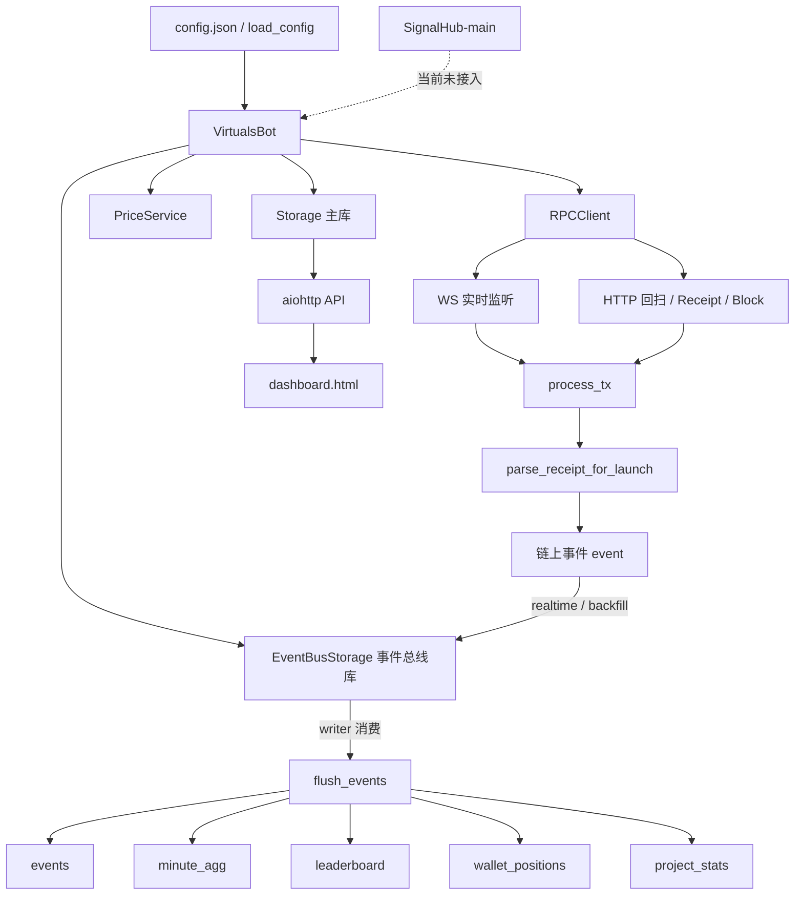
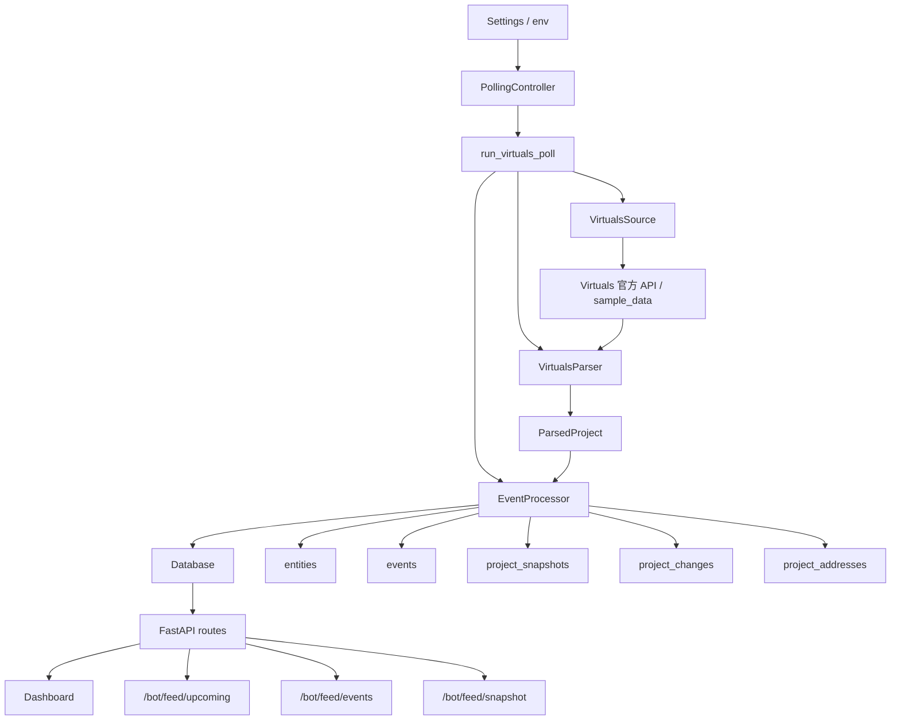
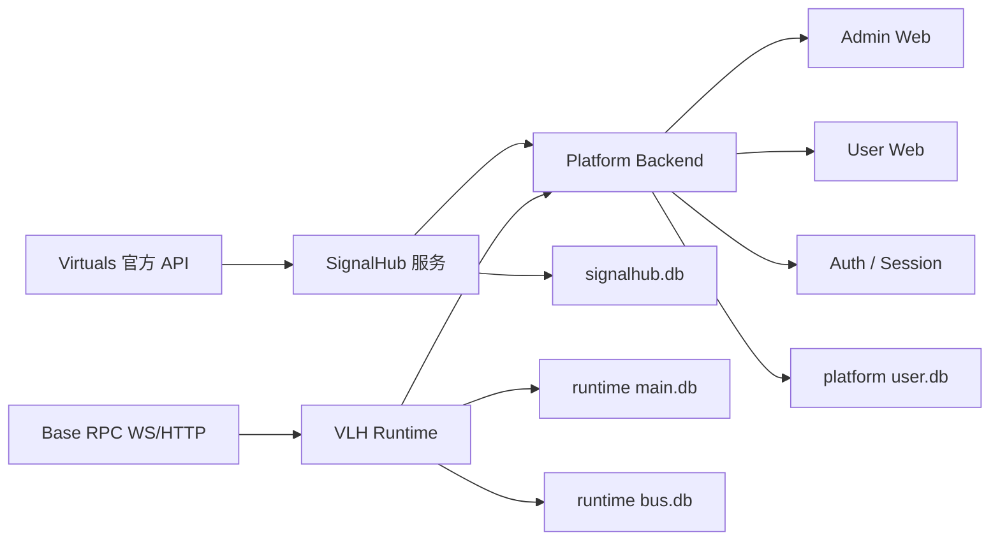

# 源码导读图

> 目的：作为当前仓库的源码阅读地图与进展记录文档，持续沉淀我们对项目结构、数据流、模块边界和改造方向的理解。

## 1. 仓库现状总览

当前仓库里实际包含两个历史来源模块，并已整合为 `Virtuals Whale Radar`：

1. `Virtuals Whale Radar` 主服务（历史名：`Virtuals-Launch-Hunter / V-Pulse`）
   - 当前主运行项目，生产域名为 `virtuals.club`
   - 技术栈：`Python + aiohttp + SQLite + dashboard.html`
   - 核心文件：
     - `virtuals_bot.py`
     - `dashboard.html`
     - `config.example.json`
     - `start_3roles.ps1`
     - `stop_3roles.ps1`

2. `SignalHub-main`
   - 独立的项目发现与项目情报服务
   - 技术栈：`FastAPI + APScheduler + SQLite`
   - 当前状态：已放入仓库，但尚未接入主运行链路

## 2. 源码模块导读图



## 3. 主项目模块边界

### 3.1 后端主程序

后端是一个单文件大单体，核心类都在 `virtuals_bot.py` 中：

- 工具函数
  - 地址、十六进制、布尔值、Decimal 转换
- `LaunchConfig`
  - 单个项目配置模型
- `AppConfig`
  - 全局运行配置模型
- `RPCClient`
  - 统一封装 `eth_getLogs / eth_getTransactionReceipt / eth_getBlockByNumber / eth_call`
- `PriceService`
  - 从链上池子读取 `VIRTUAL/USD` 价格
- `Storage`
  - 主业务库
  - 负责事件、分钟聚合、大户榜、钱包持仓、系统状态、项目配置、钱包配置
- `EventBusStorage`
  - 三角色之间的事件队列与回扫任务队列
- `VirtualsBot`
  - 总控类
  - 同时负责运行时状态、监听、解析、回扫、API、调度

### 3.2 前端单页

前端全部在 `dashboard.html` 中，职责主要包括：

- 管理员看板 UI
- 项目切换与项目配置管理
- 监控钱包管理
- 运行时暂停/恢复
- 区间回扫与任务轮询
- 分钟图、大户榜、钱包持仓、录入延迟展示
- 前端本地状态缓存
  - 当前项目
  - 回扫区间
  - 分钟区间
  - 刷新模式

### 3.3 SignalHub 独立子项目

`SignalHub-main` 当前仍是独立工程，不属于主程序内部模块：

- `signalhub/app/main.py`
  - FastAPI 入口
- `signalhub/app/api/routes.py`
  - API 路由
- `signalhub/app/scheduler/polling.py`
  - 轮询任务
- `signalhub/app/database/db.py`
  - 数据库访问
- `signalhub/app/parsers/virtuals_parser.py`
  - Virtuals 数据解析
- `signalhub/app/processors/event_processor.py`
  - 项目事件处理

## 4. 推荐阅读顺序

### 第一层：先建立整体运行模型

1. `README.md`
2. `config.example.json`
3. `start_3roles.ps1`
4. `virtuals_bot.py` 中的 `main` 和 `VirtualsBot.__init__`

### 第二层：再看基础设施层

1. `load_config`
2. `RPCClient`
3. `PriceService`
4. `Storage`
5. `EventBusStorage`

### 第三层：最后看业务链路

1. `parse_receipt_for_launch`
2. `process_tx`
3. `ws_loop`
4. `backfill_loop`
5. `run_scan_range_job_bus`
6. `flush_events`
7. `create_api_app`

### 第四层：再回到前端

1. HTML 结构区
2. `loadMeta`
3. `refreshAll`
4. 回扫和运行时控制相关函数
5. 页面事件绑定区

## 5. 主数据流

### 5.1 实时链路

```text
WS 新块/日志
-> realtime 发现 tx hash
-> process_tx 拉 receipt
-> parse_receipt_for_launch 解析成事件
-> 写入 EventBusStorage.event_queue
-> writer 消费事件
-> flush_events 写主库与聚合表
-> dashboard 调 API 刷新展示
```

### 5.2 回扫链路

```text
手动回扫 / 自动 backfill
-> 按区块范围 eth_getLogs
-> 提取 tx hash
-> process_tx
-> parse_receipt_for_launch
-> 写入 event_queue
-> writer 落主库
-> 图表 / 榜单 / 钱包持仓更新
```

### 5.3 页面刷新链路

```text
dashboard.html
-> /health
-> /mywallets
-> /minutes
-> /leaderboard
-> /event-delays
-> /project-tax
-> 渲染 KPI / 图表 / 表格
```

## 6. 数据库职责拆解

### 6.1 主库 Storage

主要表：

- `events`
  - 原始业务事件
- `wallet_positions`
  - 我的钱包持仓聚合
- `minute_agg`
  - 分钟维度统计
- `minute_buyers`
  - 每分钟唯一买家去重辅助
- `leaderboard`
  - 大户榜
- `project_stats`
  - 项目累计税收
- `system_state`
  - 全局运行状态
- `launch_configs`
  - 项目配置
- `monitored_wallets`
  - 全局监控钱包
- `dead_letters`
  - 解析失败或异常落单
- `scanned_backfill_txs`
  - 回扫去重

### 6.2 事件总线库 EventBusStorage

主要表：

- `event_queue`
  - realtime / backfill 发出的事件队列
- `role_heartbeats`
  - realtime / backfill 心跳
- `scan_jobs`
  - 手动回扫任务

## 7. API 对照表

### 7.1 页面与静态资源

| 方法 | 路径 | 作用 | 主要调用方 |
| --- | --- | --- | --- |
| GET | `/` | 返回管理台页面 | 浏览器直接打开 |
| GET | `/favicon-vpulse.svg` | 返回 SVG 图标 | 浏览器 |
| GET | `/favicon.ico` | 返回 ico 图标 | 浏览器 |

### 7.2 元数据与运行状态

| 方法 | 路径 | 作用 | 主要调用方 |
| --- | --- | --- | --- |
| GET | `/meta` | 返回项目列表、钱包列表、固定默认值、运行时调优参数 | `loadMeta` |
| GET | `/health` | 返回整体健康状态、角色状态、队列、价格、暂停状态 | `refreshAll` |
| GET | `/runtime/db-batch-size` | 读取当前入库批量大小 | `boot` |
| POST | `/runtime/db-batch-size` | 修改当前入库批量大小 | `applyDbBatchSize` |
| GET | `/runtime/pause` | 读取运行时暂停状态 | `loadRuntimePauseState` |
| POST | `/runtime/pause` | 切换运行时暂停状态 | `toggleRuntimePause` |
| POST | `/runtime/heartbeat` | 前端心跳保活，避免运行时自动暂停 | `sendRuntimeHeartbeat` |

### 7.3 项目与钱包配置

| 方法 | 路径 | 作用 | 主要调用方 |
| --- | --- | --- | --- |
| GET | `/launch-configs` | 获取项目配置列表 | `loadLaunchConfigs` |
| POST | `/launch-configs` | 新增/保存/切换项目配置 | `saveLaunchConfig` |
| DELETE | `/launch-configs/{name}` | 删除项目配置 | `deleteLaunchConfig` |
| GET | `/wallet-configs` | 获取监控钱包配置列表 | 当前主要通过 `/meta` 获取，接口已保留 |
| POST | `/wallet-configs` | 新增监控钱包 | `addMonitoredWallet` |
| DELETE | `/wallet-configs/{wallet}` | 删除监控钱包 | `deleteMonitoredWallet` |
| POST | `/wallet-recalc` | 按项目 + 单钱包重算历史持仓 | `recalcWalletForCurrentProject` |

### 7.4 回扫与数据查询

| 方法 | 路径 | 作用 | 主要调用方 |
| --- | --- | --- | --- |
| POST | `/scan-range` | 创建手动回扫任务 | `scanRangeByUtc8` |
| GET | `/scan-jobs/{job_id}` | 查询回扫进度 | `pollScanJob` |
| POST | `/scan-jobs/{job_id}/cancel` | 取消回扫任务 | `cancelScanRangeJob` |
| GET | `/mywallets` | 获取钱包持仓汇总 | `refreshAll` |
| GET | `/mywallets/{addr}` | 获取单钱包持仓明细 | 当前页面未直接使用 |
| GET | `/minutes` | 获取分钟聚合数据 | `refreshAll` |
| GET | `/leaderboard` | 获取大户榜 | `refreshAll` |
| GET | `/event-delays` | 获取交易录入延迟 | `refreshAll` |
| GET | `/project-tax` | 获取项目累计税收 | `refreshAll` |

## 8. 前后端调用关系表

### 8.1 页面初始化阶段

| 前端函数 | 调用接口 | 作用 |
| --- | --- | --- |
| `boot` | `/meta` | 初始化项目、钱包、固定参数、运行时调优 |
| `boot` | `/runtime/db-batch-size` | 兼容旧版本后端，补拉当前 DB 批量值 |
| `boot` | `/runtime/pause` | 初始化暂停状态 |
| `boot` | `/launch-configs` | 初始化项目配置表 |
| `boot` | `/health` 等 | 初始化 KPI、分钟图、榜单、钱包、延迟表 |

### 8.2 定时刷新阶段

| 前端函数 | 调用接口 | 作用 |
| --- | --- | --- |
| `refreshAll` | `/health` | 刷新角色状态、连接状态、价格、队列、暂停信息 |
| `refreshAll` | `/mywallets` | 刷新钱包持仓表 |
| `refreshAll` | `/minutes` | 刷新分钟柱状图 |
| `refreshAll` | `/leaderboard` | 刷新大户榜 |
| `refreshAll` | `/event-delays` | 刷新录入延迟表 |
| `refreshAll` | `/project-tax` | 刷新项目累计税收 |
| `sendRuntimeHeartbeat` | `/runtime/heartbeat` | 维持 UI 在线状态，避免运行时自动暂停 |

### 8.3 用户操作阶段

| 前端函数 | 调用接口 | 作用 |
| --- | --- | --- |
| `saveLaunchConfig` | `/launch-configs` | 保存项目配置或切换当前监控项目 |
| `deleteLaunchConfig` | `/launch-configs/{name}` | 删除项目配置 |
| `addMonitoredWallet` | `/wallet-configs` | 添加钱包 |
| `deleteMonitoredWallet` | `/wallet-configs/{wallet}` | 删除钱包 |
| `recalcWalletForCurrentProject` | `/wallet-recalc` | 对当前项目的单钱包历史重算 |
| `applyDbBatchSize` | `/runtime/db-batch-size` | 调节 writer 批量入库大小 |
| `toggleRuntimePause` | `/runtime/pause` | 暂停或恢复实时监听、回扫和价格刷新 |
| `scanRangeByUtc8` | `/scan-range` | 创建区间回扫任务 |
| `pollScanJob` | `/scan-jobs/{job_id}` | 轮询回扫任务状态 |
| `cancelScanRangeJob` | `/scan-jobs/{job_id}/cancel` | 取消回扫任务 |

### 8.4 后端内部调用链

页面触发接口之后，后端主要会进入以下链路：

- 项目配置变更
  - API Handler
  - `Storage.upsert_launch_config` / `Storage.delete_launch_config`
  - 刷新内存中的 launch config
  - bump revision
  - realtime 角色收到 revision 变化后重连监听

- 钱包配置变更
  - API Handler
  - `Storage.add_monitored_wallet` / `Storage.delete_monitored_wallet`
  - 刷新内存钱包集合
  - 后续新事件解析时决定 `is_my_wallet`

- 回扫任务创建
  - writer 角色写入 `EventBusStorage.scan_jobs`
  - backfill 角色的 `scan_job_dispatch_loop` 认领任务
  - `run_scan_range_job_bus`
  - `process_tx`
  - `parse_receipt_for_launch`
  - 事件写入 `event_queue`
  - writer 消费并 `flush_events`

- 看板刷新
  - API Handler 从 `Storage` 查询聚合表或状态表
  - 返回 JSON
  - 前端重绘图表、表格和 KPI

## 9. 当前已确认的关键结论

### 9.1 已实现能力

- 三角色运行模型已经完成
- 主看板已经完成
- 项目管理、钱包管理、手动回扫、自动补漏、运行时暂停都已实现
- 项目累计税收指标已实现

### 9.2 当前不是平台化双端系统

当前实现仍然是“管理员工具”，不是需求文档中的完整平台：

- 没有用户注册/登录
- 没有普通用户前端
- 没有权限模型
- 没有用户级钱包与钱包别名
- 没有接入 `SignalHub-main` 提供的 upcoming 项目流

### 9.3 `SignalHub-main` 尚未接入主链路

目前 `SignalHub-main` 在仓库中存在，但没有被 `virtuals_bot.py` 或 `dashboard.html` 调用。

这意味着当前仓库是：

- 一个可运行主项目
- 加一个尚未集成的独立上游服务

而不是一个已经打通的整合版系统。

### 9.4 多项目能力有边界

当前项目配置只允许在 UI 修改：

- `name`
- `internal_pool_addr`

以下关键字段仍走固定默认值：

- `fee_addr`
- `tax_addr`
- `fee_rate`
- `token_total_supply`

这意味着当前“多项目”更接近“多项目名 + 多内盘地址”，并不是完整独立参数模型。

### 9.5 指标口径存在一个需要注意的点

代码中分钟聚合、大户榜、钱包持仓主要使用的是 `spent_v_est`，不是 `spent_v_actual`。

这点和需求文档中的部分描述存在偏差，后续若要平台化，需要决定最终统一口径。

## 10. 函数级源码导读

这一节不再停留在“文件级别”，而是细化到类和方法，方便后续阅读和重构时快速定位。

### 10.1 顶层工具函数

`virtuals_bot.py` 开头的一组顶层函数主要服务于链上数据解析和序列化：

- 地址处理
  - `normalize_address`
  - `topic_address`
  - `decode_topic_address`
- 数值处理
  - `parse_hex_int`
  - `decimal_to_str`
  - `raw_to_decimal`
- 布尔处理
  - `parse_bool_like`
  - `parse_bool_request`
- 事件总线序列化
  - `serialize_event_for_bus`
  - `deserialize_event_from_bus`

推荐阅读顺序：

1. 地址处理函数
2. 数值转换函数
3. 事件序列化函数

因为后续 `parse_receipt_for_launch`、`Storage.flush_events`、`EventBusStorage.enqueue_events` 都依赖这些基础函数。

### 10.2 `RPCClient`

职责：统一封装链上 RPC 请求。

核心方法：

- 生命周期
  - `__aenter__`
  - `__aexit__`
- 通用调用
  - `call`
- 专用封装
  - `get_receipt`
  - `get_block_by_number`
  - `get_latest_block_number`
  - `get_logs`
  - `eth_call`

阅读建议：

先读 `call`，再读各个薄封装方法。这个类本身逻辑不复杂，主要价值是把 RPC 重试和 JSON-RPC 包装统一起来。

### 10.3 `PriceService`

职责：读取链上池子储备，维护 `VIRTUAL/USD` 价格缓存。

核心方法分组：

- 生命周期
  - `start`
  - `stop`
  - `_loop`
- 链上读取
  - `_read_address`
  - `_read_decimals`
  - `refresh_once`
- 对外接口
  - `get_price`

阅读重点：

- `refresh_once` 最关键
- 先确定交易对的 `token0 / token1`
- 再读取储备并换算出价格
- 运行时如果系统暂停，价格轮询也会停下

### 10.4 `Storage`

职责：主业务库的全部读写入口。

可以按下面几组来理解：

- 数据库初始化
  - `_init_schema`
- 运行时状态
  - `get_state`
  - `set_state`
- 初始种子数据
  - `seed_launch_configs`
  - `seed_monitored_wallets`
- 项目配置管理
  - `list_launch_configs`
  - `get_enabled_launch_configs`
  - `get_launch_config_by_name`
  - `upsert_launch_config`
  - `delete_launch_config`
  - `set_launch_config_enabled_only`
- 钱包配置管理
  - `list_monitored_wallets`
  - `add_monitored_wallet`
  - `delete_monitored_wallet`
- 回扫去重与死信
  - `save_dead_letter`
  - `get_known_backfill_txs`
  - `mark_backfill_scanned_txs`
- 核心聚合入口
  - `_event_tuple`
  - `flush_events`
- 查询接口
  - `query_wallets`
  - `query_minutes`
  - `query_leaderboard`
  - `query_event_delays`
  - `query_project_tax`
  - `count_events`
- 历史重算
  - `rebuild_wallet_position_for_project_wallet`

阅读建议：

如果只挑一个方法，优先看 `flush_events`。  
它是整个主库的聚合中心，决定事件如何增量更新到：

- `events`
- `minute_agg`
- `leaderboard`
- `wallet_positions`
- `project_stats`

### 10.5 `EventBusStorage`

职责：三角色之间的事件和任务中转层。

方法可按职责分成三组：

- 事件队列
  - `enqueue_events`
  - `fetch_events`
  - `ack_events`
  - `queue_size`
- 角色心跳
  - `upsert_role_heartbeat`
  - `get_role_heartbeat`
- 回扫任务
  - `create_scan_job`
  - `get_scan_job`
  - `request_scan_job_cancel`
  - `claim_next_scan_job`
  - `update_scan_job`
  - `is_scan_job_cancel_requested`
  - `count_scan_jobs`

阅读建议：

先看 `_init_schema`，再看 `create_scan_job` 和 `claim_next_scan_job`。  
这样最容易看懂 writer 和 backfill 是如何通过数据库表协作完成手动回扫的。

### 10.6 `VirtualsBot`

职责：系统总控。  
建议不要按文件顺序机械阅读，而是按职责分组来读。

#### A. 启动与内存状态

- `__init__`
- `__aenter__`
- `__aexit__`
- `run`
- `shutdown`

这组方法用来理解：

- 当前角色是什么
- 是否启用 API
- 是否消费事件总线
- 是否开启实时监听或回扫

#### B. 运行时状态与配置热更新

- `reload_launch_configs`
- `get_launch_configs`
- `reload_my_wallets`
- `get_my_wallets`
- `get_runtime_db_batch_size`
- `set_runtime_db_batch_size`
- `bump_launch_config_revision`
- `bump_my_wallet_revision`
- `_load_runtime_ui_last_seen`
- `touch_runtime_ui_heartbeat`
- `get_runtime_paused`
- `refresh_runtime_pause_state`
- `set_runtime_paused`
- `runtime_pause_payload`
- `wait_until_resumed`
- `launch_config_watch_loop`
- `my_wallet_watch_loop`

这组方法解释了一个很重要的运行机制：

- 配置变更通过 `system_state` 中的 revision 通知其它角色
- UI 心跳会影响系统是否继续运行
- 当 UI 长时间离线时，系统会自动进入暂停态

#### C. 事件持久化与角色协作

- `write_inserted_events_jsonl`
- `persist_events_batch`
- `emit_parsed_events`
- `build_heartbeat_payload`
- `role_heartbeat_loop`
- `bus_writer_loop`
- `scan_job_dispatch_loop`

这组方法主要解释：

- realtime / backfill 如何把事件发给 writer
- writer 如何从事件总线拉批次入库
- 角色健康状态如何对外可观测

#### D. 链上读取与交易解析

- `get_token_decimals`
- `get_block_timestamp`
- `is_related_to_launch`
- `parse_receipt_for_launch`
- `enqueue_tx`
- `process_tx`
- `consumer_loop`

这是整个系统最核心的一组方法。  
如果你要理解“这个项目到底怎么算出一笔买入交易”，重点看：

1. `is_related_to_launch`
2. `parse_receipt_for_launch`
3. `process_tx`

#### E. 实时监听与回扫

- `flush_loop`
- `flush_once`
- `ws_loop`
- `fetch_backfill_txhashes`
- `find_block_gte_timestamp`
- `find_block_lte_timestamp`
- `run_scan_range_job`
- `run_scan_range_job_bus`
- `backfill_loop`

阅读建议：

- 先读 `ws_loop` 看 realtime 逻辑
- 再读 `backfill_loop` 看自动补漏
- 最后读 `run_scan_range_job_bus` 看手动回扫

这样能分清三条链路的区别：

- 实时监听
- 自动回扫补漏
- 手动区间回扫

#### F. API Handler 与 Web 层

- 健康与运行时
  - `health_handler`
  - `runtime_db_batch_size_get_handler`
  - `runtime_db_batch_size_set_handler`
  - `runtime_pause_get_handler`
  - `runtime_pause_set_handler`
  - `runtime_heartbeat_handler`
- 回扫任务
  - `scan_range_handler`
  - `scan_job_detail_handler`
  - `scan_job_cancel_handler`
- 项目与钱包配置
  - `launch_configs_handler`
  - `monitored_wallets_handler`
  - `monitored_wallet_add_handler`
  - `monitored_wallet_delete_handler`
  - `wallet_recalc_handler`
  - `launch_config_upsert_handler`
  - `launch_config_delete_handler`
- 数据查询与静态资源
  - `meta_handler`
  - `dashboard_handler`
  - `favicon_handler`
  - `favicon_ico_handler`
  - `wallets_handler`
  - `wallet_detail_handler`
  - `minutes_handler`
  - `leaderboard_handler`
  - `event_delays_handler`
  - `project_tax_handler`
- 应用装配
  - `resolve_cors_origin`
  - `create_api_app`

阅读建议：

先读 `create_api_app` 看路由全貌，再按页面实际用到的接口去反查对应 handler。

## 11. 数据表字段速查

这一节主要记录“表存在的意义”和“关键字段代表什么”，方便后续做接口扩展、重构或迁移。

### 11.1 `events`

用途：系统最原始的业务事件表，每一行代表一次已识别的有效买入事件。

关键字段：

- 事件定位
  - `project`：项目名
  - `tx_hash`：交易哈希
  - `block_number`：区块高度
  - `block_timestamp`：链上时间
  - `created_at`：写入数据库时间
- 地址上下文
  - `internal_pool`
  - `fee_addr`
  - `tax_addr`
  - `buyer`
  - `token_addr`
- 交易结果
  - `token_bought`
  - `fee_v`
  - `tax_v`
  - `spent_v_est`
  - `spent_v_actual`
  - `cost_v`
- 估值相关
  - `total_supply`
  - `virtual_price_usd`
  - `breakeven_fdv_v`
  - `breakeven_fdv_usd`
- 标签字段
  - `is_my_wallet`
  - `anomaly`
  - `is_price_stale`

唯一约束：

- `(project, tx_hash, buyer, token_addr)`

说明：

- 同一笔交易可能被拆成多个事件，按买家和 token 去重
- 这是所有聚合表的上游事实来源

### 11.2 `wallet_positions`

用途：监控钱包在某项目下的聚合持仓表。

关键字段：

- `project`
- `wallet`
- `token_addr`
- `sum_fee_v`
- `sum_spent_v_est`
- `sum_token_bought`
- `avg_cost_v`
- `total_supply`
- `breakeven_fdv_v`
- `virtual_price_usd`
- `breakeven_fdv_usd`
- `updated_at`

主键：

- `(project, wallet, token_addr)`

说明：

- 当前钱包持仓聚合使用的是 `spent_v_est`
- `wallet_recalc` 会基于 `events` 重建这张表中的指定钱包记录

### 11.3 `minute_agg`

用途：分钟级图表聚合表，对应前端的分钟消耗柱状图。

关键字段：

- `project`
- `minute_key`：分钟时间桶，通常是秒级时间戳向下取整到分钟
- `minute_spent_v`
- `minute_fee_v`
- `minute_tax_v`
- `minute_buy_count`
- `minute_unique_buyers`
- `updated_at`

主键：

- `(project, minute_key)`

说明：

- 当前 `minute_spent_v` 来自 `spent_v_est`
- `minute_unique_buyers` 依赖辅助表 `minute_buyers`

### 11.4 `minute_buyers`

用途：辅助去重，保证每个分钟桶里的唯一买家数统计准确。

关键字段：

- `project`
- `minute_key`
- `buyer`

主键：

- `(project, minute_key, buyer)`

### 11.5 `leaderboard`

用途：项目级大户榜聚合表。

关键字段：

- `project`
- `buyer`
- `sum_spent_v_est`
- `sum_token_bought`
- `last_tx_time`
- `updated_at`

主键：

- `(project, buyer)`

说明：

- 排序主要按 `sum_token_bought` 降序
- `sum_spent_v_est` 作为辅助排序字段

### 11.6 `project_stats`

用途：项目维度的累计统计，目前主要承载累计税收。

关键字段：

- `project`
- `sum_tax_v`
- `updated_at`

主键：

- `project`

### 11.7 `launch_configs`

用途：项目配置表，决定系统当前监控哪些项目。

关键字段：

- `name`
- `internal_pool_addr`
- `fee_addr`
- `tax_addr`
- `token_total_supply`
- `fee_rate`
- `is_enabled`
- `created_at`
- `updated_at`

主键：

- `name`

说明：

- 现阶段 UI 主要只允许修改 `name` 与 `internal_pool_addr`
- 其它字段更多来自固定默认模板

### 11.8 `monitored_wallets`

用途：全局监控钱包配置表。

关键字段：

- `wallet`
- `created_at`
- `updated_at`

主键：

- `wallet`

说明：

- 当前仍然是“全局钱包”，不是用户级钱包

### 11.9 `system_state`

用途：保存各种运行时状态和轻量级配置。

典型 key：

- `runtime_paused`
- `runtime_ui_last_seen`
- `runtime_db_batch_size`
- `launch_configs_rev`
- `my_wallets_rev`
- `last_processed_block`

说明：

- 这是不同角色之间共享轻量状态的重要通道

### 11.10 `dead_letters`

用途：保存无法正常处理的交易或异常数据，便于排障。

关键字段：

- `tx_hash`
- `reason`
- `payload`
- `created_at`

### 11.11 `scanned_backfill_txs`

用途：手动回扫去重，避免重复处理已扫描过的交易。

关键字段：

- `project`
- `tx_hash`
- `scanned_at`

主键：

- `(project, tx_hash)`

### 11.12 `event_queue`

用途：realtime / backfill 发给 writer 的事件队列表。

关键字段：

- `id`
- `source`：事件来源角色，通常为 realtime 或 backfill
- `tx_hash`
- `block_number`
- `payload`
- `created_at`

说明：

- writer 会按 `id ASC` 取出并消费

### 11.13 `role_heartbeats`

用途：记录各角色上报的运行状态。

关键字段：

- `role`
- `payload`
- `updated_at`

说明：

- writer 的 `/health` 会读取这里来拼装 realtime / backfill 状态

### 11.14 `scan_jobs`

用途：记录手动回扫任务的完整生命周期。

关键字段：

- 任务标识
  - `id`
  - `status`
  - `project`
- 时间范围
  - `start_ts`
  - `end_ts`
  - `created_at`
  - `started_at`
  - `finished_at`
- 区块范围
  - `from_block`
  - `to_block`
  - `current_block`
- 进度指标
  - `total_chunks`
  - `processed_chunks`
  - `scanned_tx`
  - `skipped_tx`
  - `processed_tx`
  - `parsed_delta`
  - `inserted_delta`
- 取消和错误
  - `cancel_requested`
  - `cancel_requested_at`
  - `error`

说明：

- writer 负责创建任务
- backfill 负责认领和执行任务
- 重启后运行中的任务会被恢复为 `queued`

## 12. SignalHub-main 独立导读

这一节单独拆开 `SignalHub-main`，避免它在仓库里长期处于“存在但没人说清楚它干什么”的状态。

### 12.1 SignalHub-main 在仓库中的定位

`SignalHub-main` 是一个独立可运行的项目发现与项目情报服务，不是当前 `virtuals_bot.py` 的内部模块。

它的核心职责不是链上交易解析，而是：

- 轮询 Virtuals 官方项目源
- 识别新项目
- 跟踪项目状态与内容变化
- 提取项目地址与基础元数据
- 提供 Dashboard 与 Bot Feed API

换句话说：

- `VLH / V-Pulse` 关注的是链上交易和盘面
- `SignalHub` 关注的是“有哪些项目即将发射，以及项目元信息发生了什么变化”

### 12.2 SignalHub-main 模块导读图



### 12.3 SignalHub-main 推荐阅读顺序

建议按这条线读：

1. `signalhub/app/main.py`
   - 看应用启动、生命周期、数据库初始化、轮询控制器装配
2. `signalhub/app/config.py`
   - 看环境变量配置模型
3. `signalhub/app/scheduler/polling.py`
   - 看轮询主流程 `run_virtuals_poll`
4. `signalhub/app/sources/virtuals_source.py`
   - 看外部项目源怎么拉
5. `signalhub/app/parsers/virtuals_parser.py`
   - 看外部 JSON 怎么转成内部项目模型
6. `signalhub/app/processors/event_processor.py`
   - 看项目如何落库和生成事件
7. `signalhub/app/database/db.py`
   - 看数据库表与查询能力
8. `signalhub/app/api/routes.py`
   - 看对外 API 怎么组织

### 12.4 SignalHub-main 核心模块职责

#### `config.py`

职责：

- 定义 `Settings`
- 从环境变量读取：
  - 数据库路径
  - Virtuals API endpoint
  - 轮询频率
  - 列表模式
  - 过滤条件
  - Dashboard 路径

适合先看，因为整个服务都围绕这些设置运行。

#### `main.py`

职责：

- 创建 FastAPI 应用
- 初始化数据库
- 初始化轮询控制器
- 应用启动时可触发首次扫描

这是理解 SignalHub 生命周期的入口。

#### `scheduler/polling.py`

职责：

- 定义 `run_virtuals_poll`
- 串起完整处理链：
  - `VirtualsSource`
  - `VirtualsParser`
  - `EventProcessor`
- 定义 `PollingController`
  - 自动模式
  - 手动模式
  - 单次扫描
  - 状态查询

这是 SignalHub 的主业务入口。

#### `sources/virtuals_source.py`

职责：

- 调用 Virtuals 官方接口
- 支持分页拉取项目列表
- 支持逐项目补拉详情
- 合并列表与详情数据
- 支持 sample mode

如果后面要接入其它项目源，这一层最适合扩展。

#### `parsers/virtuals_parser.py`

职责：

- 将外部原始记录转成内部 `ParsedProject`
- 提取：
  - 项目 ID
  - 名称 / symbol
  - 状态
  - launch_time
  - contract_address
  - creator
  - team
  - links
  - tokenomics
  - 地址集合

当前已识别的地址类型包括：

- `creator`
- `token_contract`
- `treasury`
- `liquidity_pool`

注意：

- 这里能提取 `liquidity_pool`
- 但还没有 `VLH` 所需的完整 `internal_pool / fee_addr / tax_addr` 统一输出模型

#### `processors/event_processor.py`

职责：

- 对新旧项目做比对
- 写入项目实体表
- 写入快照和内容变更
- 生成标准事件
- 更新项目评分、生命周期、风险等级
- 收集地址并持久化

这个模块相当于 SignalHub 的“规则与归档中枢”。

#### `database/db.py`

职责：

- 所有数据库读写
- 对外提供项目列表、事件流、watchlist、地址、快照、变更等查询

这是 SignalHub 的数据访问层。

#### `api/routes.py`

职责：

- 对外暴露管理 API、查询 API、Bot Feed API、Dashboard

如果未来 `VLH` 要消费 `SignalHub`，这一层就是直接接入点。

### 12.5 SignalHub-main 主数据流

```text
Virtuals API / sample_data
-> VirtualsSource 拉项目列表与详情
-> VirtualsParser 解析为 ParsedProject
-> EventProcessor 比对新旧项目并打标签
-> Database 写入 entities / events / snapshots / changes / addresses
-> FastAPI routes 对外提供 dashboard 和 bot feed
```

### 12.6 SignalHub-main 关键数据表

`Database` 当前主要维护这些表：

- `entities`
  - 项目主表
  - 包含项目状态、分数、风险、生命周期、合约地址等
- `events`
  - 标准信号事件流
- `sources`
  - 上游数据源运行状态
- `project_snapshots`
  - 项目内容快照
- `project_changes`
  - 项目字段变化记录
- `project_addresses`
  - 项目相关地址集合

### 12.7 SignalHub-main 最值得关注的 API

如果只从“未来与 VLH 对接”的角度看，优先关注：

- `/bot/feed/upcoming`
  - 返回未来一段时间内即将发射的项目列表
- `/bot/feed/events`
  - 返回增量事件流
- `/bot/feed/snapshot`
  - 返回项目列表 + 事件 + 控制状态的聚合快照
- `/projects/{project_id}/contract`
  - 返回单项目的 `contract_address`
- `/projects/{project_id}/analysis`
  - 返回项目详情、事件、变更、地址列表

## 13. 两项目潜在接入点

这一节专门回答“SignalHub 后面到底怎么接到当前 VLH / V-Pulse 里”。

### 13.1 当前最可行的接入方式

如果以后做整合，最现实的方案是：

1. `VLH writer` 作为下游消费者
2. 周期性或事件驱动地拉取 `SignalHub` API
3. 用 `SignalHub` 提供的项目信息去自动维护 `launch_configs`
4. 当项目进入可追踪状态时，自动创建或更新监控任务

### 13.2 推荐优先使用的上游接口

推荐顺序：

1. `/bot/feed/snapshot`
   - 最适合做主入口
   - 一次请求就能拿到：
     - 上游源状态
     - upcoming 项目列表
     - 最近事件
     - 轮询控制状态

2. `/bot/feed/upcoming`
   - 最适合做“待发射项目列表”
   - 可按 `within_hours` 过滤

3. `/projects/{project_id}/contract`
   - 最适合做发射后补合约地址

4. `/projects/{project_id}/analysis`
   - 当你需要更丰富的地址和变更信息时再拉

### 13.3 当前已经能直接复用的字段

SignalHub 当前已经比较稳定地提供：

- `project_id`
- `name`
- `symbol`
- `status`
- `launch_time`
- `url`
- `contract_address`
- `project_score`
- `risk_level`

并且在地址层面至少能收集到：

- `creator`
- `token_contract`
- `treasury`
- `liquidity_pool`

### 13.4 当前还缺的关键字段

如果目标是“完全自动驱动 VLH”，现在仍有明显缺口。

`VLH` 真正追踪链上交易时依赖这些字段：

- `internal_pool_addr`
- `fee_addr`
- `tax_addr`
- `fee_rate`
- `token_total_supply`

而 `SignalHub` 当前能较稳定给出的更偏向：

- 项目基础信息
- 合约地址
- 流动性池地址
- 时间信息
- 项目变化事件

这意味着：

- 目前 `SignalHub` 还不能单独完成 `VLH launch_config` 的全自动填充
- 后续要么扩展 `SignalHub` 输出模型
- 要么在 `VLH` 侧增加一层地址推导/人工确认逻辑

### 13.5 实际整合时建议的字段映射

当前可以先做一版保守映射：

| SignalHub 字段 | VLH 可用位置 | 备注 |
| --- | --- | --- |
| `name` | `launch_configs.name` | 可直接使用 |
| `launch_time` | 默认回扫时间窗口起点 | 可用于自动填充 scanStart/scanEnd |
| `contract_address` | 项目展示或后续链上查询入口 | 不能直接替代 `internal_pool_addr` |
| `liquidity_pool` | 候选地址来源 | 可能可作为池地址候选，但不等于内盘地址模型已完成 |
| `project_id` | 外部关联 ID | 建议在 VLH 新增外部映射字段保存 |
| `status` | 项目状态展示 | 可用于 upcoming / live / ended 状态判断 |

### 13.6 我对整合边界的判断

现阶段更合理的整合不是“直接把 SignalHub 当成 VLH 的 launch config 全自动来源”，而是：

- 先让 `SignalHub` 负责发现和排序项目
- 再让管理员在 `VLH` 里确认或补全关键追踪地址
- 确认完成后由 `VLH` 自动进入采集、回扫和实时更新

也就是说，短期更适合做：

`SignalHub = 候选项目发现层`

`VLH = 链上追踪执行层`

而不是一步到位强行合并成单一执行模型。

## 14. 平台化目标架构

这一节开始不再描述“当前仓库是什么”，而是描述“如果按需求文档做成整合平台，目标结构应该长什么样”。

### 14.1 目标架构图



### 14.2 目标职责划分

推荐把整合后的平台拆成四层：

1. 项目发现层
   - 由 `SignalHub` 负责
   - 提供 upcoming 项目、项目状态、项目地址线索、项目事件

2. 链上追踪执行层
   - 由当前 `VLH / V-Pulse` 负责
   - 负责实时监听、回扫、解析、分钟聚合、排行榜、钱包持仓

3. 平台 API 层
   - 负责统一对外接口
   - 负责权限隔离
   - 负责把 `SignalHub` 和 `VLH` 的数据装配成管理员端与用户端可用数据

4. 前端展示层
   - 管理员端
   - 用户端

### 14.3 目标目录结构建议

如果后续进入正式重构，建议目标结构类似：

```text
platform/
  app/
    api/
      admin.py
      public.py
      auth.py
      signalhub_proxy.py
    services/
      runtime_service.py
      signalhub_service.py
      project_sync_service.py
      wallet_service.py
      auth_service.py
    storage/
      runtime_main.py
      runtime_bus.py
      user_store.py
    models/
      runtime.py
      user.py
      project.py
    config.py
    main.py
  runtime/
    virtuals_bot.py
  web/
    admin/
    user/
  docs/
```

这里的核心思想是：

- `runtime` 继续承担高频链上处理
- `platform app` 负责整合、权限、统一 API
- `SignalHub` 继续作为独立上游服务，不建议一开始就硬合并代码

## 15. 平台化改造路线图

### 15.1 第 0 阶段：冻结当前基线

目标：

- 保证当前仓库的主运行链路可读、可测、可回归
- 建立当前版本的源码导读、数据结构和 API 基线

完成标准：

- 当前文档体系补齐
- 主运行链路可做最小 smoke test
- 关键现状和已知限制都被记录

当前状态：

- 本阶段已基本完成

### 15.2 第 1 阶段：接入 SignalHub 项目流

目标：

- 在不引入用户体系前，先把管理员端升级成“项目发现 + 项目确认 + 自动配置”的控制台

关键交付：

- 新增 `signalhub_client` 或等价服务层
- 管理员端展示 upcoming 项目列表
- 支持从 `SignalHub` 自动带出：
  - `name`
  - `launch_time`
  - `contract_address`
  - `liquidity_pool`
- 对缺失字段给出“待人工补充”状态

完成标准：

- 管理员端可以看到 `SignalHub` 项目流
- 项目可以从“待同步”进入“已配置”
- 已配置项目可以进入现有 `VLH` 追踪链路

### 15.3 第 2 阶段：拆分后端单体

目标：

- 在功能不扩张太多的前提下，把当前单文件单体拆到可维护程度

关键交付：

- 拆出配置层
- 拆出 RPC 层
- 拆出主库/事件总线存储层
- 拆出解析服务
- 拆出 API handler
- 为核心聚合和解析增加基础测试

完成标准：

- `virtuals_bot.py` 不再承担全部职责
- `process_tx / parse_receipt_for_launch / flush_events` 有基本单测或回归测试
- 改动单个能力时不需要全文件联动修改

### 15.4 第 3 阶段：引入用户体系

目标：

- 建立管理员与普通用户分离的数据和权限模型

关键交付：

- 用户注册/登录
- session 或 JWT 鉴权
- 用户表
- 用户钱包表
- 用户钱包别名
- 管理员接口和普通用户接口分离

完成标准：

- 未登录用户无法访问用户页核心数据
- 普通用户无法修改系统级项目配置或任务状态
- 用户只能看到自己的钱包配置和自己的钱包视角数据

### 15.5 第 4 阶段：交付普通用户前端

目标：

- 实现需求文档中的用户侧双栏布局和项目详情页

关键交付：

- upcoming 项目列表页
- 项目详情页
- 用户设置页
- 钱包增删改名
- 登录态跳转

完成标准：

- 用户能登录
- 用户能浏览项目列表
- 用户能打开项目详情
- 用户能看到基于自己钱包的持仓数据

### 15.6 第 5 阶段：完善调度、运维和观测

目标：

- 让系统从“可跑”进入“可长期运维”

关键交付：

- 更清晰的日志
- 回扫任务监控
- 角色心跳监控
- 失败重试与死信排查
- 部署脚本统一化

完成标准：

- 服务端可观测
- 故障定位路径清晰
- 升级与回滚可控

## 16. 改造任务拆分清单

这一节尽量写到“可以直接开任务”的粒度。

### 16.1 Epic A：SignalHub 接入

- A1：新增 `SignalHub` 配置项
  - `SIGNALHUB_BASE_URL`
  - `SIGNALHUB_TIMEOUT_SEC`
- A2：封装 `SignalHub` HTTP client
- A3：拉取 `/bot/feed/snapshot`
- A4：拉取 `/bot/feed/upcoming`
- A5：新增管理员端 upcoming 项目列表
- A6：建立项目同步状态字段
  - `pending`
  - `incomplete`
  - `ready`
  - `tracking`
- A7：支持一键导入/更新为 launch config

### 16.2 Epic B：项目配置模型升级

- B1：为项目配置新增外部关联字段
  - `external_project_id`
  - `source_name`
  - `launch_time`
  - `sync_status`
- B2：允许保存候选地址信息
  - `contract_address`
  - `liquidity_pool`
- B3：明确“已确认追踪参数”和“外部同步参数”分层
- B4：为缺失关键字段项目增加人工补全流程

### 16.3 Epic C：后端模块化拆分

- C1：拆 `config`
- C2：拆 `rpc`
- C3：拆 `price_service`
- C4：拆 `storage_main`
- C5：拆 `storage_bus`
- C6：拆 `parser`
- C7：拆 `runtime_state`
- C8：拆 `api handlers`
- C9：补回归测试脚手架

### 16.4 Epic D：认证与权限

- D1：新增 `users` 表
- D2：新增 `user_wallets` 表
- D3：新增登录注册接口
- D4：新增鉴权中间件
- D5：区分管理员路由和普通用户路由
- D6：新增用户会话持久化或 JWT 策略

### 16.5 Epic E：用户钱包模型

- E1：把全局钱包和用户钱包分开
- E2：支持钱包别名
- E3：支持用户钱包增删改
- E4：用户视角钱包持仓查询接口
- E5：管理员视角继续保留全局监控钱包

### 16.6 Epic F：用户前端

- F1：登录页
- F2：注册页
- F3：用户首页 upcoming 列表
- F4：项目详情页
- F5：用户设置页
- F6：钱包别名编辑
- F7：未登录跳转

### 16.7 Epic G：运维与部署

- G1：统一 `SignalHub + Platform + Runtime` 部署模式
- G2：补 systemd / Docker Compose 方案
- G3：统一日志目录和日志格式
- G4：加健康检查与启动顺序说明
- G5：明确同域 / 分域部署推荐方案

### 16.8 Epic H：测试与验收

- H1：解析逻辑测试
- H2：聚合逻辑测试
- H3：SignalHub API 接入测试
- H4：认证测试
- H5：管理员权限测试
- H6：普通用户权限测试
- H7：端到端 smoke test

## 17. 风险清单与待决策项

### 17.1 当前主要风险

- 地址模型不完整
  - `SignalHub` 目前没有稳定输出 `internal_pool_addr / fee_addr / tax_addr`
- 统计口径不统一
  - 当前很多聚合基于 `spent_v_est`
- 全局钱包模型不适合用户化
  - 现在的 `monitored_wallets` 无法直接演进成多用户隔离模型
- UI 心跳驱动运行时暂停
  - 本地管理台可行，但平台化部署需要重新评估
- SQLite 承压边界不明确
  - 当前能跑，但多用户和更多接口后压力会变复杂
- 解析规则带有业务启发式
  - 买家识别、最终 token 流向判断需要持续校验

### 17.2 需要明确的关键决策

- 是否坚持 `SignalHub` 与 `VLH runtime` 独立部署
- 最终单一数据源选谁
  - 直接读 `SignalHub`
  - 还是平台后端二次封装
- 用户认证方式选型
  - Session
  - JWT
- 用户钱包数据是否允许跨项目复用
- 分钟图最终以 `spent_v_est` 还是 `spent_v_actual` 为准
- 平台是否保留“无管理员页面心跳则自动暂停”机制

### 17.3 我的建议

- 架构上保持 `SignalHub` 独立服务，不做代码硬合并
- 平台 API 做单一对外入口
- 先保留当前 `VLH runtime`，不要在引入用户体系前重写链上执行层
- 先做“管理员确认 + 自动追踪”，再做“用户化”

## 18. 开发与验收建议

### 18.1 最小测试集合

至少补这些测试：

- receipt 解析测试
- `flush_events` 聚合测试
- 回扫任务状态流转测试
- `SignalHub` 客户端解析测试
- 鉴权与权限测试

### 18.2 最小 smoke test 清单

- writer / realtime / backfill 可启动
- `/health` 可返回正常状态
- dashboard 可打开
- 手动回扫可创建、执行、取消
- 钱包增删有效
- 项目配置增删有效
- SignalHub 可返回 upcoming 列表
- 平台可拉取并展示 upcoming 列表

### 18.3 平台阶段验收建议

第 1 阶段验收：

- 管理员端可看到 `SignalHub` upcoming 项目
- 至少能把项目导入现有追踪体系

第 2 阶段验收：

- 关键运行链路已有模块边界和基础测试

第 3 阶段验收：

- 用户登录和权限隔离通过

第 4 阶段验收：

- 用户端项目列表、详情页、钱包设置完整可用

## 19. 后续建议拆分的目标模块

如果后续继续重构，建议从单文件中拆出这些模块：

- `app/config.py`
- `app/rpc.py`
- `app/price_service.py`
- `app/storage_main.py`
- `app/storage_bus.py`
- `app/services/parser.py`
- `app/services/runtime.py`
- `app/services/backfill.py`
- `app/api/admin.py`
- `app/api/public.py`
- `app/models.py`

## 20. 当前执行清单

这一节不是长期规划，而是“接下来真的要动手做什么”的执行列表。  
默认按优先级排序，前面的任务完成后再做后面的。

### 20.1 P0：先把 SignalHub 接进管理员端

目标：

- 让当前管理台先具备“看到 upcoming 项目并导入追踪”的能力

执行项：

- [x] 新增 `SignalHub` 接入配置
  - `SIGNALHUB_BASE_URL`
  - `SIGNALHUB_TIMEOUT_SEC`
- [x] 新增 `signalhub_client` 模块
  - 已拉 `/bot/feed/upcoming`
  - 已拉 `/projects/{project_id}/analysis`
  - 当前 P0 未使用 `/bot/feed/snapshot`
- [x] 在后端新增 `SignalHub` 代理接口
  - 供当前 `dashboard.html` 使用
- [x] 在管理员端新增 upcoming 项目列表区域
- [x] 增加“导入为项目配置”按钮
- [x] 增加“待人工补全”状态提示

完成标准：

- 管理员在当前页面能直接看到 `SignalHub` 的 upcoming 项目
- 能把某个项目导入到现有 `launch_configs`

### 20.2 P1：升级项目配置模型

目标：

- 让项目配置不再只有 `name + internal_pool_addr`

执行项：

- [ ] 为 `launch_configs` 增加扩展字段
  - `external_project_id`
  - `source_name`
  - `launch_time`
  - `sync_status`
  - `contract_address`
  - `liquidity_pool`
- [ ] 增加迁移逻辑，兼容旧库
- [ ] 调整 `/meta` 与 `/launch-configs` 返回结构
- [ ] 前端项目配置表补充同步状态展示

完成标准：

- 一个项目配置既能保存追踪参数，也能保存来自 `SignalHub` 的外部元信息

### 20.3 P2：补管理员端自动配置流程

目标：

- 让“发现项目 -> 导入 -> 补字段 -> 开始追踪”形成闭环

执行项：

- [ ] 为 upcoming 项目设计状态流转
  - `pending`
  - `incomplete`
  - `ready`
  - `tracking`
- [ ] 为缺字段项目提供明显提示
- [ ] 支持手动确认或补填关键地址
- [ ] 确认完成后自动进入当前监控项目或加入监控集合

完成标准：

- 管理员不需要手动抄项目名和时间，至少能完成半自动接入

### 20.4 P3：开始拆后端单体

目标：

- 在继续加功能前先降低维护风险

执行项：

- [ ] 把 `SignalHub client` 从主文件抽离
- [ ] 把 `RPCClient` 抽离
- [ ] 把 `PriceService` 抽离
- [ ] 把 `Storage` 与 `EventBusStorage` 抽离
- [ ] 把交易解析逻辑抽离
- [ ] 把 API handlers 抽离

推荐拆分顺序：

1. `signalhub_client`
2. `rpc`
3. `price_service`
4. `storage`
5. `parser`
6. `api`

完成标准：

- `virtuals_bot.py` 不再继续膨胀
- 新功能开发不再直接堆进单文件

### 20.5 P4：补最小测试与回归检查

目标：

- 避免一边接入 SignalHub 一边把现有聚合逻辑改坏

执行项：

- [ ] 为 `parse_receipt_for_launch` 补样例测试
- [ ] 为 `flush_events` 补聚合测试
- [ ] 为回扫任务状态流转补测试
- [ ] 为 `SignalHub client` 补响应解析测试
- [ ] 固定一套最小 smoke test 过程

完成标准：

- 每次改动后可以快速确认：
  - 实时链路没坏
  - 回扫链路没坏
  - 聚合结果没明显偏移

### 20.6 P5：用户体系放到第二批

目标：

- 避免在项目源和配置模型没稳定前提前做用户端，造成返工

执行项：

- [ ] 暂不动登录注册
- [ ] 暂不动用户端页面
- [ ] 先把管理员端做成真正的项目接入控制台
- [ ] 等项目发现和配置闭环稳定后，再做用户体系

结论：

- 目前最优先的不是“做用户端”
- 而是“先把 SignalHub 和管理员控制台打通”

### 20.7 建议的实际开工顺序

如果按最稳的方式推进，建议严格按下面顺序开工：

1. 新增 `SignalHub` 配置项
2. 新增 `signalhub_client`
3. 新增后端代理 API
4. 管理员端新增 upcoming 列表
5. `launch_configs` 扩展字段
6. 导入项目配置流程
7. 缺字段提示和人工补全
8. 最小测试补齐
9. 再开始拆后端模块
10. 最后才进入用户体系

## 21. 进展记录

### 2026-03-14

已确认：

- 当时主运行项目仍以历史名 `Virtuals-Launch-Hunter / V-Pulse` 记录；当前统一名为 `Virtuals Whale Radar`
- 后端为 `aiohttp` 单文件大单体
- 前端为单文件管理员看板
- `SignalHub-main` 为独立子项目，当前未接入
- 当前仓库尚未实现用户体系和双端权限模型
- 已补充源码导读图、主数据流、数据库职责拆解
- 已补充 API 对照表
- 已补充前后端调用关系表
- 已补充函数级源码导读
- 已补充核心数据表字段速查
- 已补充 SignalHub-main 独立导读
- 已补充两项目潜在接入点分析
- 已补充平台化目标架构
- 已补充阶段路线图
- 已补充改造任务拆分清单
- 已补充风险清单、测试建议和验收建议
- 已补充当前执行清单和实际开工顺序

当前这份文档已经覆盖：

- 当前实现的源码导读
- 主项目与 SignalHub 的结构关系
- API 与调用链
- 数据库与聚合口径
- 平台化改造方向
- 任务拆分和风险清单
- 当前应该先做什么

已开始执行 P0 最小闭环：

- 已新增 `signalhub_client.py`
- 已在 `virtuals_bot.py` 接入 `SIGNALHUB_*` 配置项
- 已新增主应用代理接口 `GET /signalhub/upcoming`
- 已在管理员端新增 `SignalHub upcoming` 卡片
- 已支持两种导入动作：
  - 有 `liquidity_pool` 时可直接导入并保存到 `launch_configs`
  - 无 `liquidity_pool` 时自动填入表单，等待人工补全
- 已更新 `config.example.json`，补齐 `SignalHub` 配置样例
- 已完成静态校验：
  - `python -m py_compile virtuals_bot.py signalhub_client.py`
  - `dashboard.html` 内联脚本通过 `node --check`
- 已完成本机 `SignalHub` 启动检查与修复：
  - 初次检查时 `127.0.0.1:8000` 未启动
  - 已安装 `SignalHub-main/requirements.txt`
  - 已启动本机 `SignalHub`
  - `GET http://127.0.0.1:8000/healthz` 返回 `200`
- 已完成一轮端到端联调：
  - `SignalHub` live feed 正常返回 upcoming 项目
  - 主应用 `writer` 实例在 `127.0.0.1:8080` 正常提供 API 与 dashboard
  - `/health`、`/meta`、`/signalhub/upcoming`、`/launch-configs` 已验证
  - 浏览器已验证 dashboard 能显示 `SignalHub` upcoming 卡片
  - 浏览器已验证：
    - `填入表单` 路径可把项目名写入配置表单，并提示缺少内盘地址
    - 人工补内盘地址后可保存为 `launch_configs`
    - 受控模拟 `syncReady=true` 后，`导入并保存` 路径可自动保存
  - 测试过程产生的临时项目配置已清理并恢复为 `WORK`
  - 已额外验证 `role=all` 实例可在隔离端口启动并通过 `/health`
